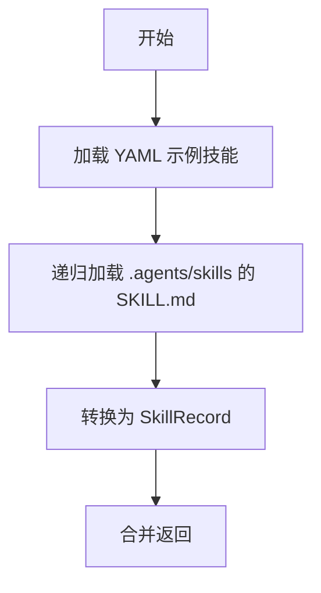
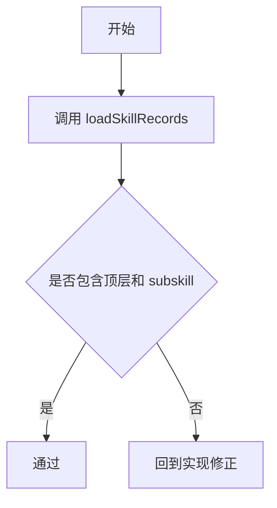
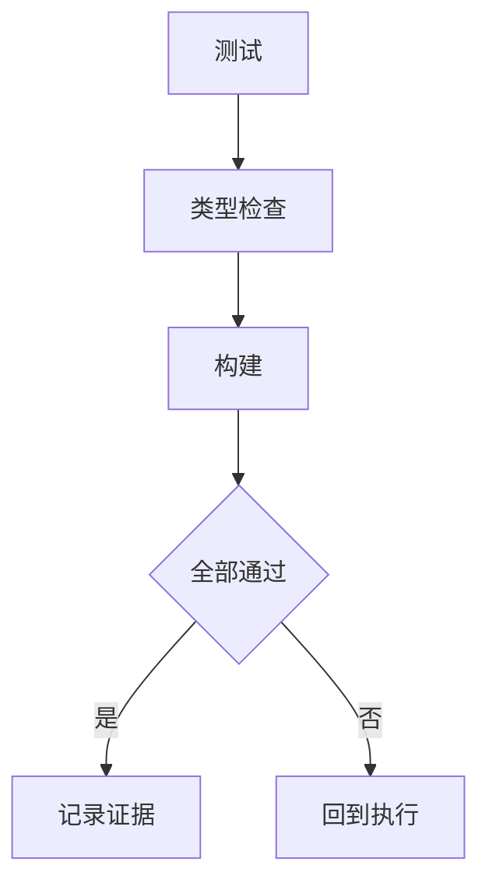

# 交付单元标识

- module_id: module-01-agent-skill-source

# 阅读导航

- 任务总数：3
- 串行任务：3
- 可并行任务：0

# 全局摘要

在现有静态 YAML 数据源旁边增加 `.agents/skills/**/SKILL.md` 数据源，统一转换为 `SkillRecord`，并用测试证明顶层和子技能都进入列表。

# 任务拆解

## T1 - 扩展技能加载器

- 任务目标：递归加载 `.agents/skills/**/SKILL.md` 并转换为 `SkillRecord`。
- 范围与影响面：`src/content/skills/load-skill-records.ts`。
- 执行模式：串行。

## T2 - 增加回归测试

- 任务目标：覆盖本地 agent skill 递归发现、分类和发布状态。
- 范围与影响面：`src/content/skills/load-skill-records.test.ts`。
- 执行模式：串行。

## T3 - 验证与记录

- 任务目标：运行测试、类型检查和构建。
- 范围与影响面：验证与评审工件。
- 执行模式：串行。

# 功能拆解明细

- 发现规则：`.agents/skills/**/SKILL.md`。
- id 规则：`agent-` + 路径片段，去掉 `subskills`。
- 中文标题：根据框架和阶段 slug 映射。
- 中文简介：根据所属框架和阶段生成。
- 详情说明：生成中文 Markdown，包含来源路径和触发名。

# API 对接与类型策略

无 API。输出类型为现有 `SkillRecord`。

# 依赖关系

T1 -> T2 -> T3。

# 整洁性与复杂度控制

将映射逻辑收敛在加载器内部，不改调用方。

# 模式决策与替代方案

- 采用加载器聚合数据源。
- 不采用手工复制 YAML，避免本地 skill 更新后目录失真。

# 代码上下文与影响范围

见 `artifacts/code-context.md`。

# 并行执行建议

不启用并行，改动集中且短。

# 测试策略

- 增加 `loadSkillRecords()` 数据源测试。
- 运行 `npm run test`、`npm run typecheck`、`npm run build`。

# 回滚说明

移除 `.agents` glob 和映射测试即可回到原 YAML-only 数据源。
