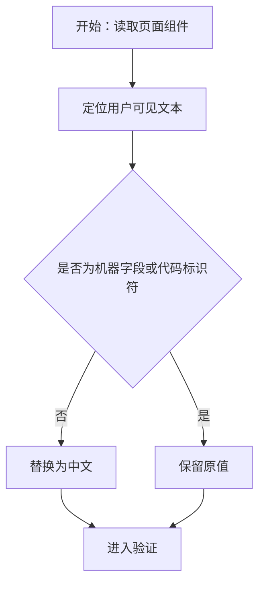
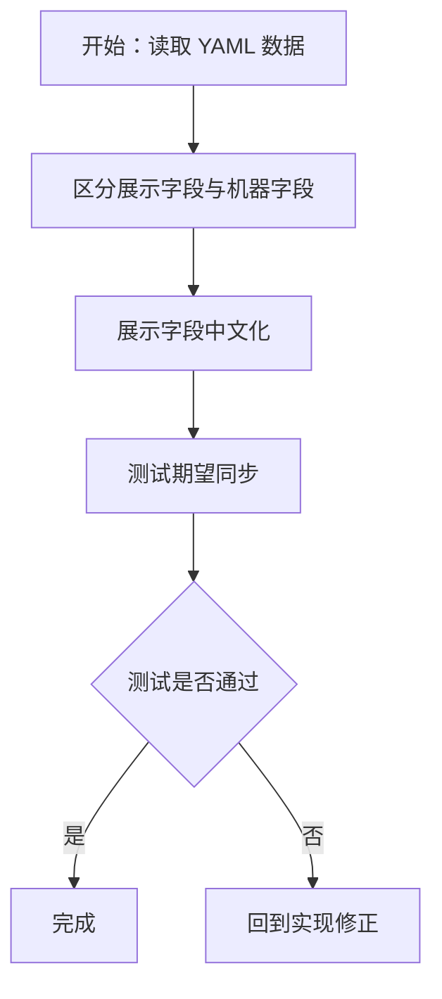
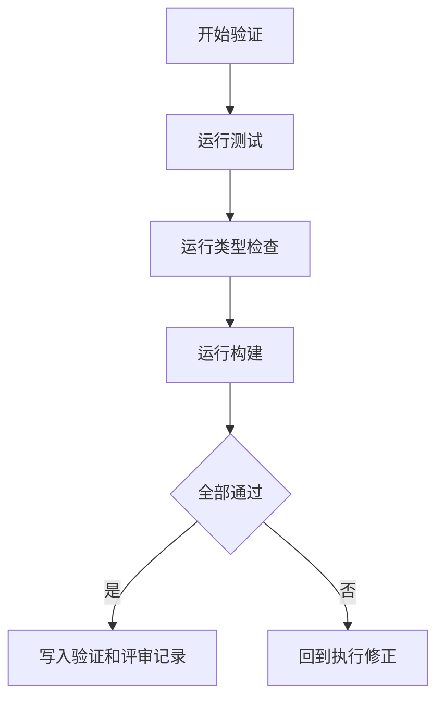

# 交付单元标识

- module_id: module-01-localize-visible-copy

# 阅读导航

- 任务总数：3
- 串行任务：3
- 可并行任务：0
- 关键依赖：TypeScript 上下文、页面和 YAML 数据扫描

# 全局摘要

本计划以最小文本替换完成中文化：先确认影响范围，再修改页面/组件/数据文案，最后更新测试并执行验证。无 API 和架构变更。

# 任务拆解

## T1 - 中文化页面与公共组件

- 任务目标：替换 Vue 页面与组件中的用户可见英文和乱码中文。
- 规格映射：首页、列表页、详情页、公共组件、技能组件。
- 范围与影响面：`src/views`、`src/components/common`、`src/features/skills/components`。
- 执行模式：串行。
- 测试与验证要点：类型检查、构建渲染。

## T2 - 中文化展示数据与测试期望

- 任务目标：替换 `_data` 中展示字段并同步测试。
- 规格映射：示例技能名称、描述、标签、变更记录、分类标签。
- 范围与影响面：`_data/config.yaml`、`_data/skills/*.yaml`、相关测试。
- 执行模式：串行。
- 测试与验证要点：单元测试应反映正确中文标签。

## T3 - 验证与记录

- 任务目标：执行测试、类型检查和构建，补齐交付证据。
- 规格映射：验收标准。
- 范围与影响面：验证工件、评审工件。
- 执行模式：串行。
- 测试与验证要点：`npm run test`、`npm run typecheck`、`npm run build`。

# 功能拆解明细

- 搜索输入：只改 placeholder，不改输入归一化和路由同步。
- 排序下拉：只改 option 展示文本，不改 `value`。
- 主题切换：只改显示文本，不改 `dark/light` 状态值。
- 安装命令复制：只改按钮和反馈文本，不改 clipboard 调用。
- YAML 数据：展示字段中文化，命令和枚举保留。

# API 对接与类型策略

无 API 对接。TypeScript 上下文见 `artifacts/code-context.md`。

# 依赖关系

T1 -> T2 -> T3。

# 整洁性与复杂度控制

不新增抽象，不引入 i18n，不修改结构性逻辑。

# 模式决策与替代方案

- 采用直接文本替换。
- 拒绝引入 i18n：当前需求是单语言中文化，引入框架会扩大范围。

# 代码上下文与影响范围

见 `artifacts/code-context.md`。

# 并行执行建议

不启用 workflow-style parallel execution；任务紧密耦合且范围小。

# 触发与上下文准备

已读取项目文件列表、TS 配置、相关类型声明和页面组件。

# 受影响文件或模块

- `src/views/*.vue`
- `src/components/common/*.vue`
- `src/features/skills/components/*.vue`
- `_data/config.yaml`
- `_data/skills/*.yaml`
- `src/content/config/site-config.test.ts`
- 可能涉及查询测试样例

# 测试策略

- `npm run test`
- `npm run typecheck`
- `npm run build`

# 观察与人工介入点

若验证失败且属于文案/测试同步问题，直接修正；若出现需求范围变化，再回到 spec。

# 回滚说明

可通过 Git diff 审查并按文件回退文案变更。
