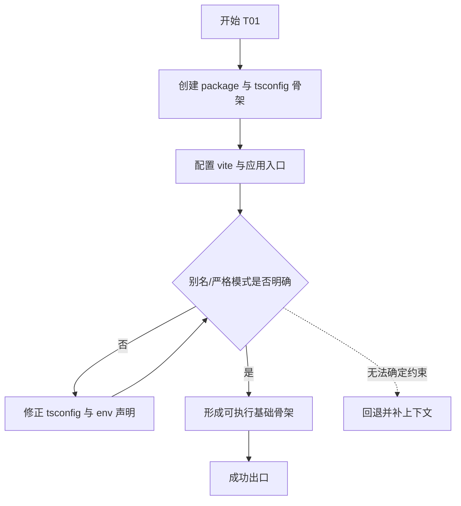
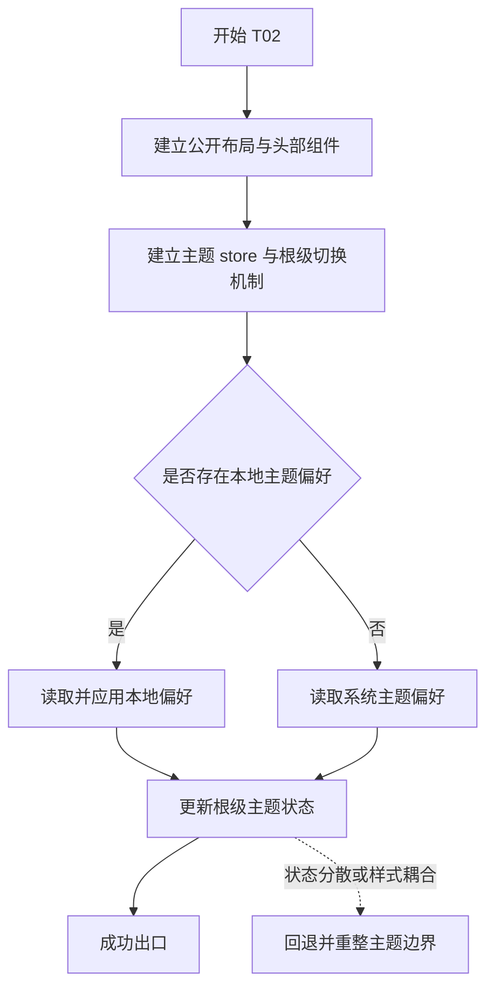
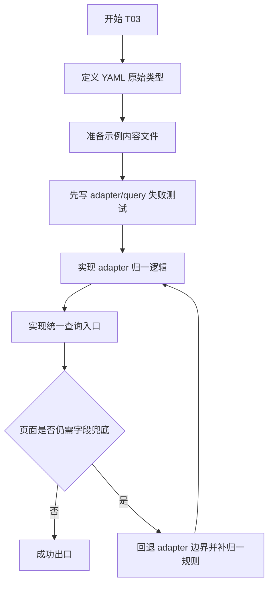
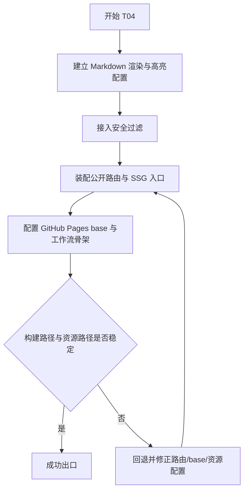

# 计划

## 交付单元标识

- Request: `prd-skillhub-personal-skill-distribution`
- Module: `module-01-platform-foundation`
- 当前阶段：`plan`

## 阅读导航

- 请求目标摘要：为纯静态 SkillHub 搭建可持续扩展的前端基础骨架
- 任务总数：4
- 串行任务数：4
- 可并行任务数：0
- 高风险任务：`T03 内容读取与适配边界`、`T04 SSG 与 GitHub Pages 兼容基座`
- 关键依赖：Vite + Vue 3 + TypeScript、Vite SSG、YAML 内容导入、主题持久化
- 文档跳转索引：
  - `T01` 工程与 TS 骨架
  - `T02` 公共壳层与主题系统
  - `T03` 内容模型、adapter 与查询入口
  - `T04` Markdown、SSG 与部署兼容基座

## 全局摘要

本次计划只覆盖平台基础模块，不进入首页、列表页和详情页的具体业务布局。执行主线是：先建立项目骨架与 TypeScript 上下文，再建立共享壳层与主题系统，然后收拢静态内容读取 / adapter / query 边界，最后补齐 Markdown、SSG 和 GitHub Pages 兼容配置。

最大风险点有两个：一是 YAML 内容结构若没有在 adapter 层归一，后续页面会把语义修补散落到组件里；二是 GitHub Pages 的 `base` 与静态路由策略如果前期没有钉住，后续页面完成后还会被迫回头改入口和资源路径。

实施前前置条件：

- 当前模块 `spec` 已批准
- 当前范围固定为“纯静态 GitHub Pages，无后台”
- 允许在网络未知的前提下手动搭建等价脚手架

## 任务拆解

### T01 工程与 TypeScript 骨架

#### 任务目标

建立可运行的 Vue 3 + TypeScript + Vite 工程骨架，并明确当前模块受哪些 `tsconfig` 与路径别名约束。

#### 规格映射

- `spec`:
  - 工程骨架初始化
  - TypeScript 上下文建立
  - Project Bootstrap and Scaffold Decision

#### 范围与影响面

- `package.json`
- `tsconfig.json`
- `tsconfig.app.json`
- `vite.config.ts`
- `index.html`
- `src/app/*`
- `src/env.d.ts`

#### 前置条件

- 用户已批准 `spec`
- 明确当前允许手动搭建等价骨架

#### 实现子项

- 创建最小可运行的 Vite Vue TypeScript 项目文件
- 配置 `@` 指向 `src`
- 固定 `strict`、Vite 环境类型和应用作用域 tsconfig
- 预留 SSG 入口文件和应用装配入口

#### 交互与状态约束

- 本任务不引入用户可见业务交互
- 完成条件是项目可被后续任务继续装配，而不是页面已完整可用

#### API 与数据约束

- 无远程 API
- 仅建立本地 YAML 内容将来的导入能力，不在本任务内定义业务数据规则

#### 测试与验证要点

- 本任务以构建级验证为主
- 可通过类型检查和基础构建命令验证
- 如测试框架同步接入成本低，可一并初始化；否则延后到涉及业务逻辑的任务

#### 风险与回退

- 若依赖安装受限，可先生成文件骨架与配置，再等待安装权限
- 如 `tsconfig` 结构不合理，必须在本任务内修正，不得拖到业务页面阶段

#### Mermaid 流程图

### T02 公共壳层与主题系统

#### 任务目标

建立公开站点共享布局、全局头部、容器结构和暗/亮主题切换机制，为后续页面提供统一壳层。

#### 规格映射

- `spec`:
  - 公开站点共享壳层
  - 主题系统
  - Design Constraints

#### 范围与影响面

- `src/layouts/*`
- `src/components/common/*`
- `src/stores/theme*`
- `src/assets/styles/*`
- `src/App.vue`

#### 前置条件

- `T01` 完成应用骨架与 store 装配入口

#### 实现子项

- 创建公开站点基础布局组件
- 创建站点头部组件与主题切换组件
- 建立主题 token / CSS 变量与根级 class 或 data-attribute 切换方案
- 使用本地存储持久化主题偏好，并支持系统偏好兜底

#### 交互与状态约束

- 主题切换入口在头部右侧
- 首次访问无本地偏好时跟随系统主题
- 切换主题后状态立即反映到根级样式，不允许页面各自维护颜色状态

#### API 与数据约束

- 无远程 API
- 主题状态只属于 UI 层，不与内容数据混用

#### 测试与验证要点

- 适合做行为测试：
  - 主题偏好初始化逻辑
  - 主题切换后根级状态变化
- 若测试框架已就绪，按 TDD 写主题 store / composable 测试
- 若当前阶段先不落测试框架，必须在执行记录中说明例外，并通过手动验证 + 后续任务补测闭环

#### 风险与回退

- 若样式 token 组织混入页面业务语义，必须回退调整
- 若主题状态分散到多个组件，视为 clean-code blocker

#### Mermaid 流程图

### T03 内容模型、Adapter 与查询入口

#### 任务目标

建立 `_data` 内容读取、原始类型定义、adapter 归一和统一查询入口，严格落实“数据语义适配只能发生在 adapter 层”的约束。

#### 规格映射

- `spec`:
  - 内容数据读取与适配
  - 领域查询入口
  - API and Data Contracts
  - Design Constraints

#### 范围与影响面

- `_data/config.yaml`
- `_data/skills/*.yaml`
- `src/content/**/*`
- `src/types/content.ts`
- `src/types/skill.ts`
- `src/features/skills/queries/*`

#### 前置条件

- `T01` 完成 YAML 导入与 TS 基础

#### 实现子项

- 创建站点配置与技能的原始类型
- 准备最小示例 YAML 数据
- 创建 adapter，把原始 SkillRecord 归一为 `SkillSummary` / `SkillDetail`
- 创建查询函数：
  - `loadSiteConfig`
  - `loadPublishedSkills`
  - `getSkillById`
  - `listRelatedSkills`

#### 交互与状态约束

- 本任务不直接提供页面交互
- 必须保证后续页面拿到的是稳定的领域数据，而不是半原始对象

#### API 与数据约束

- 合同源仅为 `_data/config.yaml` 与 `_data/skills/*.yaml`
- 归一规则至少覆盖：
  - `usageExamples` 缺失转空数组
  - `tags` 非法空值转空数组
  - `installCount` 缺失转 `0`
  - 时间字段转为可比较语义
- 严禁把这些语义修正留给页面层

#### 测试与验证要点

- 这是最适合先做 TDD 的任务
- 先写 adapter / query 单元测试，再实现最小通过逻辑
- 覆盖：
  - 已发布技能过滤
  - 缺失字段默认值
  - 详情按 `id` 查询
  - 相关推荐不包含当前技能

#### 风险与回退

- 若出现页面层需要额外兜底的数据语义，说明 adapter 设计不完整，必须回退本任务修正
- 若原始类型和领域类型没有清晰边界，后续页面会持续耦合

#### Mermaid 流程图

### T04 Markdown、SSG 与 GitHub Pages 兼容基座

#### 任务目标

补齐 Markdown 渲染与安全过滤、代码高亮、SSG 路由装配、GitHub Pages `base` 兼容和部署骨架。

#### 规格映射

- `spec`:
  - Markdown 与代码渲染基础能力
  - SSG 与 GitHub Pages 兼容基础
  - Acceptance Criteria 4 / 6

#### 范围与影响面

- `src/utils/markdown/*`
- `src/router/*`
- `src/app/ssg.ts`
- `vite.config.ts`
- `.github/workflows/*`
- 可能包含 `README.md` 的运行 / 构建说明

#### 前置条件

- `T01` 提供项目入口
- `T03` 提供静态内容来源

#### 实现子项

- 创建统一 Markdown 渲染器
- 接入 XSS 过滤和代码高亮
- 建立公开站点基础路由
- 配置 Vite SSG 与 GitHub Pages `base`
- 准备最小部署工作流骨架

#### 交互与状态约束

- Markdown 渲染输出必须可被详情页后续直接消费
- GitHub Pages 子路径部署不能要求页面层自行修正链接

#### API 与数据约束

- 无运行时 API
- 构建阶段消费本地内容数据

#### 测试与验证要点

- Markdown 渲染逻辑可做单测或快照测试
- SSG 与构建兼容主要靠构建验证
- 部署工作流本阶段至少验证配置结构正确，真实 GitHub Actions 运行留到 verify 阶段以“静态检查 + 配置审阅”为主

#### 风险与回退

- 若 Markdown 工具输出与页面消费耦合过深，后续详情页会难以维护
- 若 `base` 策略未钉住，部署后静态资源路径可能全部失效

#### Mermaid 流程图

## 功能拆解明细

### 工程骨架

- 应用入口：
  - 容器：`src/app/main.ts`
  - 用途：装配应用、挂载 Router / Pinia / Head
  - 默认行为：本地开发可直接启动；静态构建可直接消费
- TypeScript 配置：
  - 主配置：`tsconfig.json`
  - 应用配置：`tsconfig.app.json`
  - 别名：`@ -> src`
  - 严格模式：开启
  - 声明补充：`src/env.d.ts`

### 公共壳层与主题

- 展示容器：
  - 页面：公开站点全局布局
  - 字段组：Logo、站点标题、搜索入口占位、主题切换按钮、主体容器、页脚占位
  - 显示规则：所有公开页面共享
- 主题交互：
  - 触发入口：头部主题切换按钮
  - 前置条件：页面已加载
  - 界面变化：根级主题 class / data-attribute 更新
  - 副作用：写入本地存储
  - loading：无
  - 成功条件：视觉主题即时切换且刷新后保持

### 内容与查询

- 配置内容：
  - 文件：`_data/config.yaml`
  - 字段：`site.title`、`site.description`、`site.baseUrl`、`categories`
- 技能内容：
  - 文件：`_data/skills/*.yaml`
  - 字段：`id`、`name`、`category`、`version`、`shortDesc`、`fullDesc`、`installCommand`、`usageExamples`、`tags`、`status`、`installCount`、`createdAt`、`updatedAt`
- 归一规则：
  - `usageExamples` 缺失 -> `[]`
  - `tags` 为非法空值 -> `[]`
  - `installCount` 缺失 -> `0`
  - 仅 `published` 参与公开查询

### Markdown 与 SSG

- Markdown 渲染：
  - 容器：`src/utils/markdown/*`
  - 输入：技能详细描述 / 更新日志原文
  - 输出：安全 HTML
  - 规则：支持代码高亮和 XSS 过滤
- 路由与 SSG：
  - 公开页面走静态生成
  - `base` 支持 GitHub Pages 项目子路径
  - 构建产物可直接部署到静态托管

## 项目脚手架与初始化策略

- 存在合适脚手架：Vite Vue TypeScript starter
- 计划采用来源：按其结构与配置约束手动搭建等价骨架
- 适配原因：
  - 与 PRD 技术栈一致
  - 对纯静态公开站点足够轻量
  - 易于引入 Vite SSG 和 YAML 内容导入
- 初始化后还需补齐：
  - `src/app/*` 装配结构
  - `content/`、`features/skills/`、`layouts/` 分层
  - GitHub Pages `base`
  - Markdown 与 YAML 内容链路
- 执行阶段不得重新发明：
  - 放弃 TypeScript
  - 改用另一套构建体系
  - 把内容适配逻辑散回页面

## API 对接与类型策略

- 本模块无服务端 API 对接
- 数据契约来源：
  - `_data/config.yaml`
  - `_data/skills/*.yaml`
- 类型策略：
  - 原始 YAML 类型保存在 `types/content.ts`
  - 页面消费类型保存在 `types/skill.ts`
  - adapter 负责语义归一
- 无 protobuf、无 OpenAPI、无 backend-owned TypeScript declarations

## 依赖关系

- `T01 -> T02`
- `T01 -> T03`
- `T01 -> T04`
- `T03 -> T04`
- 当前模块不建议并行，因为每一步都在固定后续任务边界

## 整洁性与复杂度控制

- 不把内容读取、内容适配、列表查询和页面壳层写进同一文件
- 不允许页面模板自行兜底 YAML 语义
- 主题持久化和内容查询分别保有独立职责
- 若发现某个任务需要引入额外 manager / service 才能推进，先回看 spec 的模式决策

## 模式决策与替代方案

- 采用：
  - Adapter
  - Query Module
- 拒绝：
  - Repository
  - Manager
  - Event Bus
  - Strategy / State 的提前抽象
- 原因：当前变化轴少、数据源稳定、纯静态内容不值得引入重层级模式

## 代码上下文与影响范围

- 当前仓库无存量代码
- 本模块产物会影响后续所有页面模块
- 其中最关键的影响范围：
  - 内容目录与类型边界
  - 主题系统
  - SSG 入口与 `base` 策略

## 并行执行建议（含是否值得启用 workflow）

- 当前不建议启用 workflow-style parallel execution
- 原因：
  - 工程骨架、内容边界与 SSG 策略具有强前后依赖
  - 过早并行会造成目录、类型和入口反复冲突

## 触发与上下文准备

- 触发：
  - 用户已批准当前模块 `spec`
- 上下文：
  - PRD 与 request 工件
  - 当前模块 architecture-design / spec / clarifications
  - 仓库当前仍为 greenfield

## 受影响文件或模块

- `package.json`
- `vite.config.ts`
- `tsconfig.json`
- `tsconfig.app.json`
- `index.html`
- `src/app/*`
- `src/layouts/*`
- `src/components/common/*`
- `src/stores/*`
- `src/content/*`
- `src/features/skills/*`
- `src/utils/markdown/*`
- `src/types/*`
- `_data/config.yaml`
- `_data/skills/*`
- `.github/workflows/*`

## 测试策略

- 优先 TDD：
  - `T03` adapter / query
  - `T02` 主题状态逻辑
  - `T04` Markdown 渲染核心
- 构建级验证：
  - 类型检查
  - 基础构建
  - 路由 / `base` / SSG 产物检查
- 如测试框架初始化被依赖安装阻塞，执行阶段必须在 `execution/changelog.md` 中记录例外，并通过构建验证与静态审阅补充证据

## 观察与人工介入点

- 若依赖安装失败，需要确认是否允许申请网络 / 权限安装依赖
- 若 GitHub Pages `base` 需要面向具体仓库名定制，可能需要你补充最终仓库发布路径
- 若安装量字段最终不打算展示，可在后续详情模块中进一步收敛

## 回滚说明

- 若 `tsconfig` / 入口结构影响后续任务理解，回滚到 `T01`
- 若发现页面仍需自行做数据语义兜底，回滚到 `T03`
- 若部署路径与资源路径不稳定，回滚到 `T04`
