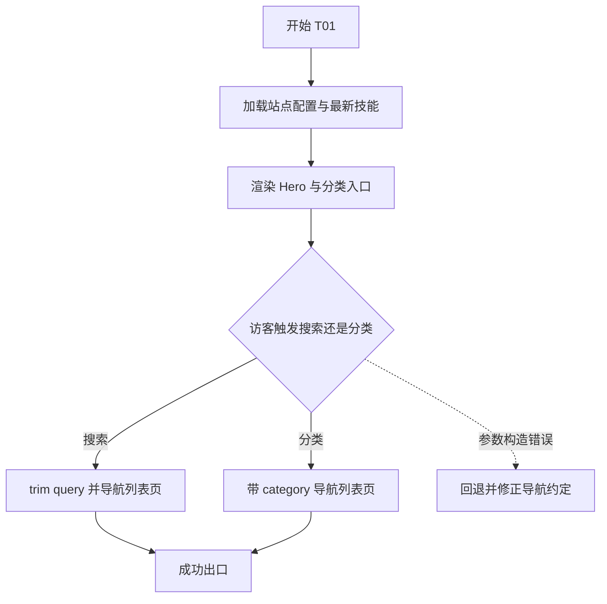
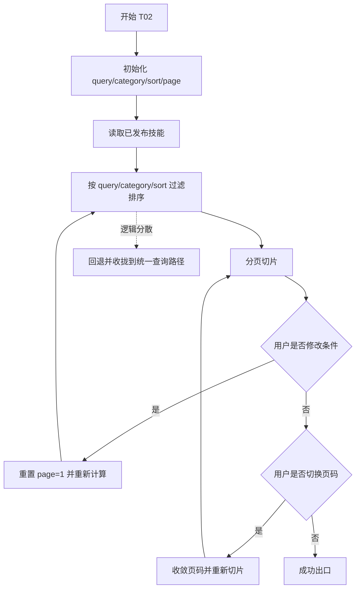
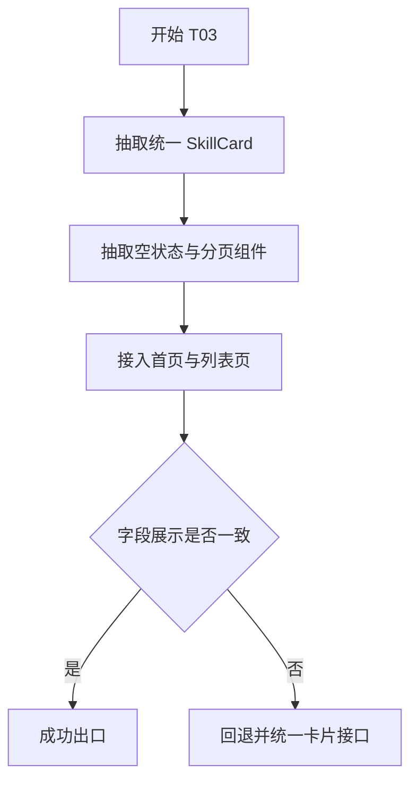
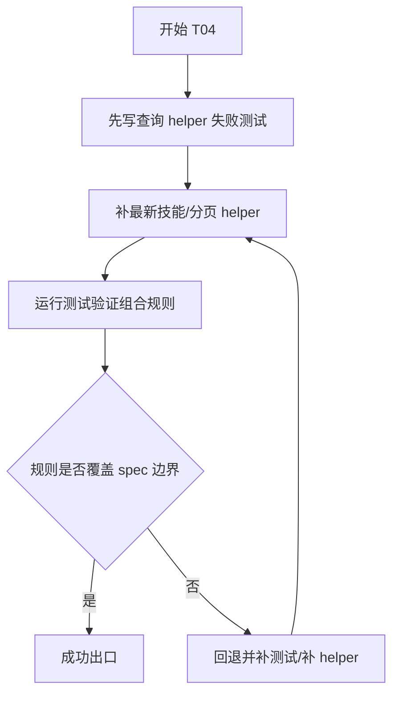

# 计划

## 交付单元标识

- Request: `prd-skillhub-personal-skill-distribution`
- Module: `module-02-public-discovery`
- 当前阶段：`plan`

## 阅读导航

- 请求目标摘要：完成首页与列表页的公开发现路径
- 任务总数：4
- 串行任务数：4
- 可并行任务数：0
- 高风险任务：`T02 搜索/分类/排序/分页状态编排`
- 关键依赖：`module-01` 查询入口、共享布局、主题系统、静态数据
- 文档内跳转索引：
  - `T01` 首页 Hero 与分类快捷入口
  - `T02` 列表页状态编排与分页
  - `T03` 技能卡片、空状态与结果区
  - `T04` 查询层扩展与验证补强

## 全局摘要

本次计划覆盖首页和列表页，不触碰详情页转化区。执行主线是：先把首页的发现入口和导航链路接起来，再把列表页的搜索、分类、排序、分页状态稳定编排，随后把卡片与空状态组件抽成统一展示单元，最后补查询层扩展和对应测试，确保首页与列表页都消费同一套领域模型。

最关键的状态主线是：`query/category/sort/page` 共同驱动列表结果。这里最容易出错的是“条件切换后页码不同步”以及“模板里分散写查询逻辑”，所以这些规则会集中落在容器层和查询 helper 中。

实施前必须满足的前置条件：

- `module-02 spec` 已批准
- `module-01` 已通过 verify / review
- 当前分页主路径固定为页码分页，不做滚动加载

## 任务拆解

### T01 首页 Hero 与分类快捷入口

#### 任务目标

把首页从“基础骨架页”升级为真实的公开发现入口，支持 Hero 文案、可输入搜索框、分类快捷入口和最新技能区。

#### 规格映射

- `spec`:
  - 首页 Hero
  - 首页分类快捷入口
  - 首页最新技能卡片区

#### 范围与影响面

- `src/views/HomeView.vue`
- 可能新增首页局部组件
- `src/router/index.ts` 中的导航参数约定

#### 前置条件

- 共享壳层和查询入口已由 `module-01` 提供

#### 实现子项

- 重构首页 Hero 内容与主行动
- 添加可输入搜索框
- 分类快捷入口读取 `loadSiteConfig()`
- 最新技能区读取最新技能集合并展示卡片
- 搜索和分类入口导航到列表页并带上参数

#### 交互与状态约束

- 首页搜索值：
  - `trim`
  - 纯空格视为未输入
  - 回车或点击主行动触发导航
- 分类快捷入口：
  - 点击即导航
  - 带入分类参数

#### API 与数据约束

- 无远程 API
- 只消费 `SkillSummary`

#### 测试与验证要点

- 首页导航参数构造
- 纯空格输入不带 query
- 最新技能区在无数据时显示空状态

#### 风险与回退

- 若首页把列表页状态逻辑提前做成全局共享，会增加无必要耦合；发现此趋势时回退

#### Mermaid 流程图

### T02 列表页状态编排与分页

#### 任务目标

建立列表页的 `query/category/sort/page` 组合状态，并确保条件变更、页码重置、分页切片和结果统计始终同步。

#### 规格映射

- `spec`:
  - 列表页搜索区
  - 列表页分类筛选
  - 列表页排序
  - 列表页分页
  - 列表页结果区

#### 范围与影响面

- `src/views/SkillsView.vue`
- 查询 helper 扩展

#### 前置条件

- `T01` 已明确列表页路由参数入口

#### 实现子项

- 建立列表页本地状态：
  - `query`
  - `category`
  - `sort`
  - `page`
- 建立参数归一规则
- 切换分类 / 排序 / 搜索后重置页码为 1
- 结果超过 20 条时启用分页切片
- 结果区展示总数与当前上下文

#### 交互与状态约束

- 搜索输入：
  - 输入中实时生效
  - `trim` 后空值视为不过滤
- 分类切换：
  - 默认“全部”
  - 非法分类回退“全部”
- 排序切换：
  - 默认最新
- 页码：
  - 超界自动收敛
  - 切换页码后滚动到结果区顶部

#### API 与数据约束

- 继续复用 `loadPublishedSkills`
- 新增分页结果 helper，不新增另一套内容模型

#### 测试与验证要点

- 查询条件组合测试
- 切换分类 / 排序 / 搜索后页码重置
- 分页边界测试
- 非法分类与超界页码收敛

#### 风险与回退

- 若查询逻辑同时散在页面 computed 和 helper 中，必须回退统一

#### Mermaid 流程图

### T03 技能卡片、空状态与结果区

#### 任务目标

抽出统一 `SkillCard`、空状态组件和分页组件，保证首页与列表页字段展示一致，且无结果时有稳定反馈。

#### 规格映射

- `spec`:
  - 首页最新技能卡片区
  - 列表页结果区
  - 空状态
  - 接受标准 5 / 6

#### 范围与影响面

- `src/features/skills/components/*`
- `src/views/HomeView.vue`
- `src/views/SkillsView.vue`

#### 前置条件

- `T01`、`T02` 提供页面容器和状态输出

#### 实现子项

- 提取 `SkillCard`
- 提取空状态组件
- 提取分页组件
- 首页与列表页统一复用卡片字段：
  - 名称
  - 短描述
  - 分类
  - 版本
  - 可选图标

#### 交互与状态约束

- 卡片点击进入详情页
- 空状态提供重置筛选入口
- 分页组件仅在总页数大于 1 时显示

#### API 与数据约束

- 组件只接收已准备好的 props，不自行拉数据

#### 测试与验证要点

- 组件复用字段一致性
- 空状态在无技能 / 无结果两种情况下都可见

#### 风险与回退

- 若首页和列表页出现两套卡片样式与字段顺序，必须回退并统一

#### Mermaid 流程图

### T04 查询层扩展与验证补强

#### 任务目标

补齐首页 / 列表页所需的查询 helper 与测试，把搜索、筛选、分页的规则固化成可回归行为。

#### 规格映射

- `spec`:
  - Edge Cases
  - Acceptance Criteria 1-6

#### 范围与影响面

- `src/features/skills/queries/skill-queries.ts`
- `src/features/skills/queries/*.test.ts`

#### 前置条件

- `T02` 已明确状态组合
- `T03` 已明确组件消费接口

#### 实现子项

- 扩展查询 helper：
  - `getLatestSkills`
  - `paginateSkills`
  - 必要的上下文格式化方法
- 补测试覆盖：
  - 搜索
  - 分类
  - 排序
  - 分页
  - 空结果

#### 交互与状态约束

- 该任务本身不加 UI，但决定 UI 展示结果是否稳定

#### API 与数据约束

- 仍然只消费 `SkillSummary`
- 不新增运行时接口

#### 测试与验证要点

- 优先 TDD
- 新 helper 先写失败测试，再补实现

#### 风险与回退

- 若 helper 设计逼迫页面层再补额外规则，说明抽象不完整，回退本任务修正

#### Mermaid 流程图

## 功能拆解明细

### 首页搜索框

- 容器：首页 Hero
- 用途：把访客带到列表页并附带查询条件
- 字段：
  - `query`
- 控件类型：文本输入
- 默认值：空字符串
- 输入归一：
  - `trim`
  - 纯空格视为空
  - 归一化后为空则不带 query
- 校验：
  - 无错误提示
  - 不做长度限制
- 提交方式：
  - 回车
  - 点击主行动按钮

### 列表页搜索框

- 容器：列表页顶部
- 用途：即时过滤技能结果
- 字段：
  - `query`
- 控件类型：文本输入
- 默认值：来自路由参数或空字符串
- 输入归一：
  - `trim`
  - 纯空格视为空
  - 按归一化值匹配
- 校验触发：
  - 输入过程中即时生效
- 提示：
  - 无错误提示

### 列表页分类筛选

- 容器：桌面侧栏 / 移动端顶部标签条
- 字段：
  - `category`
- 默认值：`all`
- 选项来源：
  - `SiteConfig.categories`
- 规则：
  - 分类与搜索条件可叠加
  - 切换后页码重置
  - 非法值回退 `all`

### 列表页排序

- 容器：列表页顶部结果栏
- 字段：
  - `sort`
- 默认值：`latest`
- 选项：
  - `latest`
  - `name`
- 规则：
  - 切换后页码重置

### 列表页分页

- 容器：列表页底部
- 用途：浏览超过 20 条的结果
- 规则：
  - 每页 20 条
  - 总页数 <= 1 时隐藏
  - 页码越界收敛

### 卡片展示

- 容器：首页 / 列表页
- 字段：
  - `name`
  - `shortDesc`
  - `category`
  - `version`
  - `icon`
- 空值规则：
  - 无图标时用统一占位
- 交互：
  - 点击进入详情页

### 空状态

- 容器：首页最新技能区、列表页结果区
- 类型：
  - 无已发布技能
  - 搜索 / 筛选结果为空
- 行为：
  - 列表页提供重置筛选入口

## 项目脚手架与初始化策略

- 继续复用 `module-01` 已落地的脚手架
- 当前模块不调整基础目录，只新增页面与技能展示组件
- 执行阶段不得重新改造入口结构、tsconfig 和 SSG 基座

## API 对接与类型策略

- 无远程 API
- 数据来源：
  - `_data/config.yaml`
  - `_data/skills/*.yaml`
- 类型策略：
  - 继续使用 `SkillSummary`
  - 新增分页结果类型可放在 `types/skill.ts` 或查询模块内部

## 依赖关系

- `T01 -> T02`
- `T02 -> T03`
- `T02 -> T04`
- `T03 -> T04`

## 整洁性与复杂度控制

- 页面容器只负责状态编排和布局，不重复实现字段格式化
- 搜索 / 分类 / 排序 / 分页组合逻辑不散落在多个模板表达式中
- 卡片字段顺序和空值规则统一

## 模式决策与替代方案

- 采用：
  - Query Helper 扩展
- 拒绝：
  - 全局搜索 store
  - 模糊搜索库
  - 双实现卡片组件

## 代码上下文与影响范围

- 主要改动：
  - `HomeView.vue`
  - `SkillsView.vue`
  - `src/features/skills/components/*`
  - `src/features/skills/queries/skill-queries.ts`

## 并行执行建议（含是否值得启用 workflow）

- 当前不建议并行
- 原因：
  - 首页与列表页共享同一套卡片与查询规则
  - 若并行容易造成字段与状态组合不一致

## 触发与上下文准备

- 触发：
  - 用户批准 `module-02 spec`
- 上下文：
  - `module-01` 已完成并可用
  - `module-02` 的 page-design / architecture-design / spec

## 受影响文件或模块

- `src/views/HomeView.vue`
- `src/views/SkillsView.vue`
- `src/features/skills/components/*`
- `src/features/skills/queries/skill-queries.ts`
- 如有需要，`src/types/skill.ts`

## 测试策略

- TDD 优先落在查询 helper 和状态规则上
- UI 组件重点通过：
  - 路由参数构造
  - 查询结果切换
  - 空状态显示
  - 分页边界
- 构建与类型检查仍作为最终补充验证

## 观察与人工介入点

- 若你后续希望首页搜索直接在首页下方即时展开结果，而不是跳列表页，需要在下一轮 spec 变更中处理
- 当前分页主路径已固定为页码分页，若想改无限滚动，需要重新走 spec / plan

## 回滚说明

- 若页码和筛选不同步，回滚 `T02`
- 若首页与列表页卡片不一致，回滚 `T03`
- 若查询 helper 不能覆盖 spec 规则，回滚 `T04`
