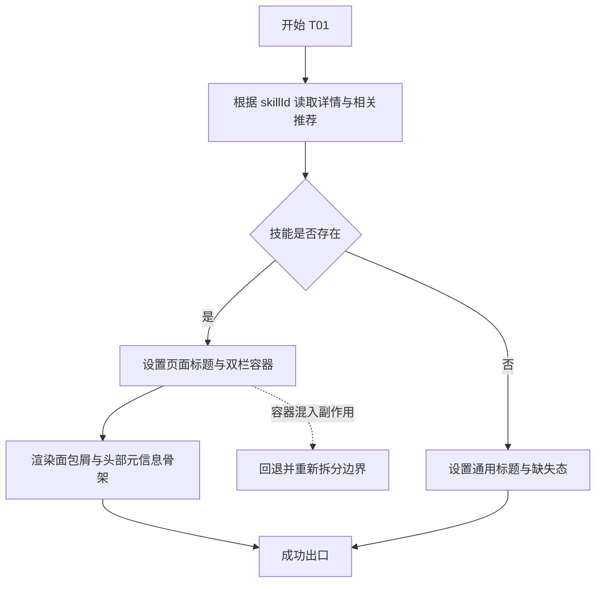
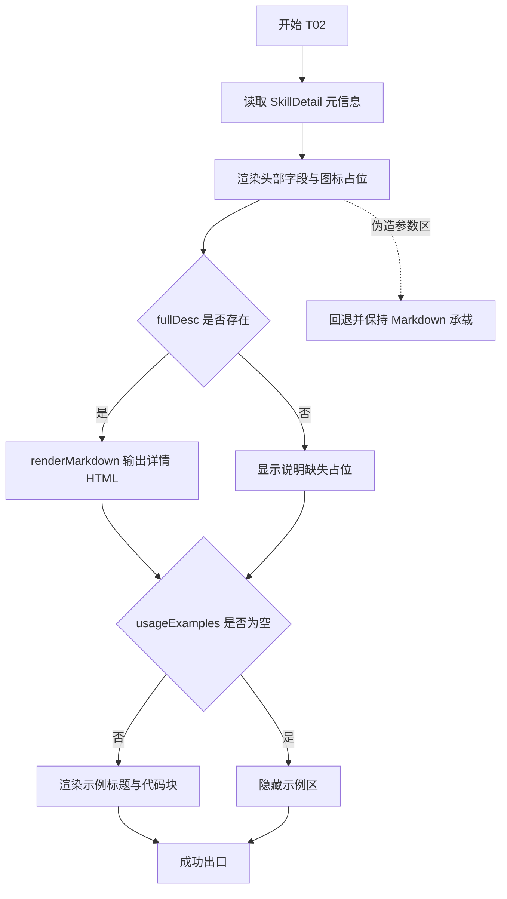
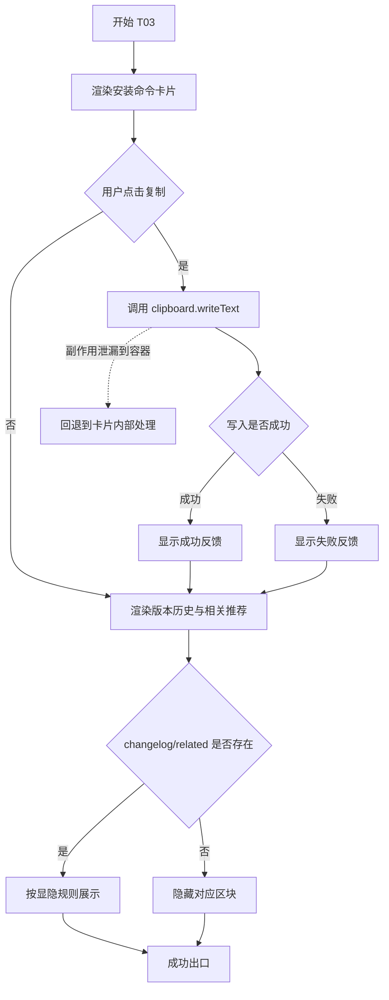
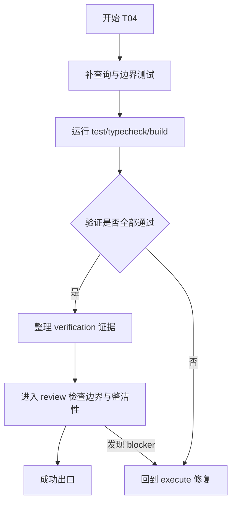

# 计划

## 交付单元标识

- Request: `prd-skillhub-personal-skill-distribution`
- Module: `module-03-skill-detail`
- 当前阶段：`plan`

## 阅读导航

- 请求目标摘要：把详情页从占位展示升级为可阅读、可复制、可继续浏览相关推荐的正式转化页
- 任务总数：4
- 串行任务数：4
- 可并行任务数：0
- 高风险任务：`T03 侧栏转化区与复制反馈`
- 关键依赖：
  - `getSkillById`
  - `listRelatedSkills`
  - `renderMarkdown`
  - `SkillDetail`
- 文档内跳转索引：
  - `T01` 详情页容器与头部元信息骨架
  - `T02` Markdown 内容区与使用示例区
  - `T03` 安装命令卡片、版本历史与相关推荐
  - `T04` 查询补强、验证留痕与回归

## 全局摘要

本次计划只覆盖 `module-03` 的详情页，不扩展后台、远程上报或新的内容合同。执行主线是：先稳定详情页容器、标题回退和基础布局，再完成主内容区的元信息与 Markdown 阅读体验，随后落侧栏转化区和复制反馈，最后补齐相关推荐规则验证与构建级回归证据。

最关键的状态主线是：`published detail -> render content -> optional sections -> copy command feedback`。最大风险点有两个：一是把内容缺失兜底散落进模板分支，二是把剪贴板副作用放到页面容器里导致职责混乱。实施前必须保持现有数据边界不变，尤其是参数说明与安装量语义，不能在视图层伪造结构化数据。

实施前前置条件：

- `module-03 spec` 已批准
- `module-02` 已通过 review，详情页入口已建立
- 继续复用现有 TypeScript 上下文：
  - `tsconfig.app.json -> tsconfig.json`
  - `moduleResolution: Bundler`
  - `baseUrl: .`
  - `paths: @/* -> src/*`
  - `strict: true`

## 任务拆解

### T01 详情页容器与头部元信息骨架

#### 任务目标

把当前占位型 `SkillDetailView.vue` 升级成正式详情页容器，完成面包屑、标题区、双栏布局、缺失态回退和页面标题规则。

#### 规格映射

- `spec`:
  - User Flow 1 / 2
  - Page and Module Design
  - Function-Complete Behavior Breakdown / 详情元信息区
  - 页面标题与 SEO
  - Edge Cases / 技能不存在时

#### 范围与影响面

- `src/views/SkillDetailView.vue`
- `src/router/index.ts`
- 可能复用 `src/layouts/PublicLayout.vue`

#### 前置条件

- 查询层仍能通过 `getSkillById(props.skillId)` 读取已发布技能
- 当前路由继续支持静态详情页与 `/skills/:skillId` 双入口

#### 实现子项

- 以页面容器形式读取：
  - `skill`
  - `relatedSkills`
  - `renderedDescription`
- 增加面包屑导航，至少包含返回 `/skills`
- 明确页面标题规则：
  - 有技能：`<skill name> · SkillHub`
  - 无技能：`Skill Detail · SkillHub`
- 组织桌面双栏 / 移动堆叠布局
- 接入详情缺失态文案和主内容占位区，而不是仅输出空白 HTML
- 把头部展示从页面内联文本拆到详情元信息组件或局部独立区

#### 交互与状态约束

- 页面容器只做数据编排与布局，不承接复制副作用
- 技能不存在时：
  - 页面标题回退
  - 主内容显示缺失提示
  - 侧栏不再渲染依赖技能数据的区块

#### API 与数据约束

- 无远程 API
- 详情数据只消费已适配 `SkillDetail`
- 不新增结构化参数字段

#### 测试与验证要点

- 构建级验证详情页仍可静态产出
- 代码审阅确认标题回退与缺失态逻辑清晰
- 如需新增纯函数辅助标题或缺失态映射，可补 Vitest

#### 风险与回退

- 若容器内同时堆入复制逻辑、相关推荐过滤和 Markdown 拼装，需回退到组件边界
- 若面包屑依赖硬编码路由名导致静态详情页不稳，需回退为显式路径链接

#### Mermaid 流程图

### T02 Markdown 内容区与使用示例区

#### 任务目标

完成详情页左侧主内容区，使 Markdown 描述和使用示例稳定呈现，并严格遵守“无结构化参数字段时不伪造参数区”的约束。

#### 规格映射

- `spec`:
  - Function-Complete Behavior Breakdown / Markdown 详细描述区
  - 使用示例区
  - 参数 / 环境说明区
  - Design Constraints
  - Clarifications / 参数说明区

#### 范围与影响面

- `src/views/SkillDetailView.vue`
- `src/features/skills/components/SkillDetailMeta.vue`
- 可能新增主内容局部区块组件
- 复用 `src/utils/markdown/render-markdown.ts`

#### 前置条件

- `T01` 已提供稳定的主内容容器
- `renderMarkdown` 当前仍支持标题、列表、链接和代码块高亮

#### 实现子项

- 展示字段清单：
  - 图标
  - 名称
  - 版本
  - 分类
  - 最后更新时间
  - 安装量（遵循已批准假设）
- 图标缺失时使用统一占位
- Markdown 说明区：
  - 优先渲染 `fullDesc`
  - 若内容缺失，展示可理解占位说明
- 使用示例区：
  - 读取 `usageExamples`
  - 每项展示标题和代码块
  - 空数组时整区隐藏
- 参数 / 环境说明区：
  - 首版不创建伪参数表
  - 由 Markdown 内容自然承载相关说明

#### 交互与状态约束

- Markdown 区只读，不附加复制或展开交互
- 使用示例区仅按数据显隐，不自行过滤文本语义
- 页面层不得通过解析 Markdown 文本来生成“参数表”

#### API 与数据约束

- 所有内容来自 `SkillDetail`
- `usageExamples` 已在 adapter 归一为空数组或合法示例数组
- 已批准假设：
  - `installCount <= 0` 视为当前没有可展示的有效安装量，元信息区隐藏该字段

#### 测试与验证要点

- 适配层现有测试继续保证 `usageExamples` 归一
- 构建与代码审阅确认：
  - Markdown 缺失占位可见
  - 使用示例空数组时整区隐藏
  - 未出现伪结构化参数区

#### 风险与回退

- 若页面模板出现多处 `||` 文案兜底并夹杂业务判断，需回退到容器预处理或 adapter 边界
- 若安装量展示规则需要区分“0 次”与“未知”，后续必须回到 adapter / spec，而不是模板热修

#### Mermaid 流程图

### T03 安装命令卡片、版本历史与相关推荐

#### 任务目标

完成右侧转化区，把安装命令复制、版本历史和相关推荐控制在独立组件边界中，并确保复制成功 / 失败反馈明确可见。

#### 规格映射

- `spec`:
  - Function-Complete Behavior Breakdown / 安装命令卡片
  - 版本历史区
  - 相关推荐区
  - Page Design / 右侧侧栏
  - Architecture Design / side-effect boundary
  - Clarifications / 版本历史区

#### 范围与影响面

- `src/features/skills/components/InstallCommandCard.vue`
- `src/features/skills/components/SkillVersionHistory.vue`
- `src/features/skills/components/SkillRelatedList.vue`
- `src/views/SkillDetailView.vue`
- `src/features/skills/queries/skill-queries.ts`

#### 前置条件

- `T01` 已提供侧栏挂载位
- `listRelatedSkills` 仍能按当前技能分类产出候选项

#### 实现子项

- 安装命令卡片：
  - 展示安装命令代码块
  - 提供复制按钮
  - 在组件内部处理剪贴板写入
  - 成功时显示成功反馈
  - 失败时显示失败反馈
- 版本历史区：
  - 有 `changelog` 时渲染 Markdown
  - 无 `changelog` 时整区隐藏
- 相关推荐区：
  - 最多展示 4 项
  - 不包含当前技能
  - 不足 4 项按实际数量展示
  - 点击进入对应详情页

#### 交互与状态约束

- 复制交互：
  - 触发入口：复制按钮
  - 前置条件：存在安装命令字符串
  - loading：不额外展示 loading
  - 反馈：按钮附近或卡片内即时反馈，不依赖全局 toast
- 相关推荐：
  - 仅使用已经准备好的 `SkillSummary[]`
  - 无相关推荐时整区隐藏

#### API 与数据约束

- 安装命令直接来自 `skill.installCommand`
- 版本历史首版只消费 `skill.changelog`
- 相关推荐继续复用 `listRelatedSkills`
- 页面容器不得再次写“排除自己、最多 4 个”的业务规则

#### 测试与验证要点

- `listRelatedSkills` 规则测试：
  - 当前技能不存在时返回空数组
  - 结果不包含自己
  - 最多 4 项
- 复制反馈：
  - 若执行阶段抽出局部可测 helper，则补 success / failure 单测
  - 否则以构建验证 + 代码审阅记录副作用边界

#### 风险与回退

- 若为了复制反馈引入全局消息系统，需回退
- 若相关推荐过滤规则散到组件模板和查询层两处，需回退为查询层唯一归属

#### Mermaid 流程图

### T04 查询补强、验证留痕与回归

#### 任务目标

补齐 `module-03` 需要的查询规则验证与阶段留痕，确保执行完成后能够用测试、类型检查、构建和审阅证据关闭本模块。

#### 规格映射

- `spec`:
  - Acceptance Criteria 1-5
  - Edge Cases
  - Human Review and Handoff

#### 范围与影响面

- `src/features/skills/queries/skill-queries.ts`
- `src/features/skills/queries/skill-queries.test.ts`
- `docs/requests/.../verification/verification.md`
- `docs/requests/.../review/review.md`

#### 前置条件

- `T01` ~ `T03` 已完成

#### 实现子项

- 为相关推荐规则补充或更新测试
- 如复制交互提炼出可测 helper，则补对应 success / failure 测试
- 运行并记录：
  - `npm test`
  - `npm run typecheck`
  - `npm run build`
- 在 verify 阶段按验收标准逐项回填证据
- 在 review 阶段检查：
  - 页面容器是否混责
  - 副作用是否留在安装卡片
  - 数据语义是否停留在 adapter / query 层

#### 交互与状态约束

- 验证与 review 不新增产品行为
- 若 verify 发现显隐或反馈不符合 spec，回到 execute，不在文档中“解释通过”

#### API 与数据约束

- 继续以本地 YAML + adapter 为唯一合同源
- 任何新增规则测试都对准 `SkillDetail` / `SkillSummary` 既有合同

#### 测试与验证要点

- 单元测试优先覆盖可枚举业务规则
- 构建与类型检查验证页面、路由、SSG 输出未退化
- 详情页生成产物至少覆盖一个真实技能详情路径

#### 风险与回退

- 若测试试图证明模板细节而不是规格行为，需回退到更稳定的 helper 或构建证据
- 若验证发现需要新增产品判断，说明计划粒度不足，应先回到 spec / plan，不直接硬补

#### Mermaid 流程图

## 功能拆解明细

### 详情页容器

- 所在页面：`SkillDetailView.vue`
- 用途：组织详情数据、布局、标题与缺失态
- 展示字段：
  - 面包屑
  - 名称
  - 版本
  - 分类
  - 更新时间
  - 安装量
- 布局：
  - 桌面双栏
  - 移动堆叠
- 空值规则：
  - 技能不存在时显示缺失态
  - 标题回退到通用文案
- 可复制行为：
  - 仅侧栏安装命令卡片可复制

### Markdown 详细描述区

- 所在容器：左侧主内容区
- 数据来源：`skill.fullDesc`
- 展示格式：`renderMarkdown` 输出 HTML
- 空值规则：内容缺失时显示说明占位
- 显隐规则：主描述区始终保留；仅内容形态在“HTML / 占位”之间切换

### 使用示例区

- 所在容器：左侧主内容区
- 数据来源：`skill.usageExamples`
- 展示顺序：按数组原始顺序
- 每项字段：
  - `title`
  - `code`
- 显隐规则：空数组时整区隐藏

### 参数 / 环境说明区

- 所在容器：左侧主内容区
- 当前策略：不新增独立结构化区块
- 说明承载：由 Markdown 详情内容承担
- 禁止事项：不得解析 Markdown 字符串并伪造参数表

### 安装命令卡片

- 所在容器：右侧侧栏顶部
- 展示字段：
  - 安装命令代码块
  - 复制按钮
  - 反馈文案
- 触发入口：复制按钮
- 前置条件：存在安装命令
- 副作用：`clipboard.writeText`
- loading：无
- 成功反馈：即时成功提示
- 失败反馈：即时失败提示
- 重试方式：用户可再次点击复制

### 版本历史区

- 所在容器：右侧侧栏中部
- 数据来源：`skill.changelog`
- 展示格式：Markdown
- 显隐规则：无 `changelog` 时整区隐藏

### 相关推荐区

- 所在容器：右侧侧栏底部
- 数据来源：`listRelatedSkills(skillId, 4)`
- 展示规则：
  - 最多 4 项
  - 排除当前技能
  - 不足 4 项不补位
- 交互：点击跳转对应详情页
- 空值规则：无相关推荐时整区隐藏

## 项目脚手架与初始化策略

- 当前模块不再新建脚手架
- 继续复用 `module-01` 已批准的 Vue 3 + Vite + TypeScript + Vite SSG 工程骨架
- 执行阶段不得重新发明：
  - 路由模式
  - 主题系统
  - Markdown 渲染方案
  - 数据入口位置

## API 对接与类型策略

- 无远程 API
- 契约来源：
  - `_data/skills/*.yaml`
  - `src/content/adapters/skill-adapter.ts`
  - `src/types/skill.ts`
- 类型策略：
  - 继续直接复用 `SkillDetail` / `SkillSummary`
  - 不新增伪结构化参数类型
- adapter boundary：
  - `usageExamples`、`tags` 等语义归一继续留在 adapter
  - 页面不得承担“空字符串转 undefined / 非法数组转空数组”等职责
- query ownership：
  - `listRelatedSkills` 拥有相关推荐筛选与裁剪规则
  - 页面只消费结果

## 依赖关系

- 串行依赖：
  - `T01 -> T02 -> T03 -> T04`
- 原因：
  - 布局容器先确定，主内容和侧栏组件才能稳定挂载
  - 相关推荐和复制反馈依赖最终侧栏边界
  - 测试与验证依赖全部功能闭环

## 整洁性与复杂度控制

- `SkillDetailView.vue` 只保留数据编排、头部设置、布局装配
- 复制副作用只能在 `InstallCommandCard` 中出现
- 相关推荐规则只能在查询层出现一次
- 页面模板避免散落业务语义兜底；需要归一时优先回到 adapter / query helper
- 若单组件同时承担布局、数据整形和副作用，执行阶段必须立即拆分

## 模式决策与替代方案

- 采用：轻量展示组件拆分
- 原因：详情页已有清晰变化轴，且多个区块具备独立显隐与职责边界
- 不采用：
  - 详情页专用 store
  - 全局 toast / 消息总线
  - 伪参数模型适配器
- 更简单替代方案为什么不足：
  - 全塞进 `SkillDetailView.vue` 会把布局、复制副作用和展示规则混在一起，后续移动端与 review 成本过高

## 代码上下文与影响范围

- 代码上下文工件：`docs/requests/prd-skillhub-personal-skill-distribution/artifacts/code-context.md`
- 直接影响：
  - `src/views/SkillDetailView.vue`
  - `src/features/skills/components/*`
  - `src/features/skills/queries/skill-queries.ts`
  - `src/features/skills/queries/skill-queries.test.ts`
- 邻近回归面：
  - 首页 / 列表页跳转详情
  - Markdown 渲染与代码高亮
  - 静态详情页路由生成

## 并行执行建议

- 本模块不建议启用 workflow-style parallel execution
- 原因：
  - 详情页布局、主内容区与侧栏区块强耦合于同一容器
  - 复制反馈与相关推荐规则都依赖最终组件边界
  - 并行拆分会增加合并和样式回归成本

## 触发与上下文准备

- trigger：用户已批准 `module-03 spec`
- context：
  - 已存在 `page-design` / `architecture-design` / `spec` / `clarifications`
  - 已有详情页占位实现可增量改造
- handoff：
  - 当前 plan 需用户审批后才能进入 execute

## 受影响文件或模块

- `src/views/SkillDetailView.vue`
- `src/features/skills/components/InstallCommandCard.vue`
- `src/features/skills/components/SkillDetailMeta.vue`
- `src/features/skills/components/SkillRelatedList.vue`
- `src/features/skills/components/SkillVersionHistory.vue`
- `src/features/skills/queries/skill-queries.ts`
- `src/features/skills/queries/skill-queries.test.ts`
- 如需样式抽离，允许新增同目录局部组件样式

## 测试策略

- 单元测试：
  - 相关推荐规则
  - 新增纯函数 helper（若有）
- 构建级验证：
  - `npm run build`
  - 检查详情页静态产物仍生成
- 类型与回归：
  - `npm run typecheck`
  - `npm test`
- 审阅重点：
  - 页面容器边界
  - 数据语义归属
  - 副作用位置

## 观察与人工介入点

- 用户介入点：
  - 当前 `module-03 plan` 审批
- 执行阶段观察点：
  - 复制反馈是否足够明确
  - 移动端安装命令卡片是否足够靠前
  - 无 `changelog` / 无相关推荐时是否留下空白卡片

## 回滚说明

- 若执行阶段发现：
  - 参数说明需要结构化字段
  - 安装量语义需要区分“未知”和“0”
  - 复制反馈需要跨页面全局消息体系
- 则先回到 `spec` 或 `architecture-design`，不得在页面层临时拼接方案。
