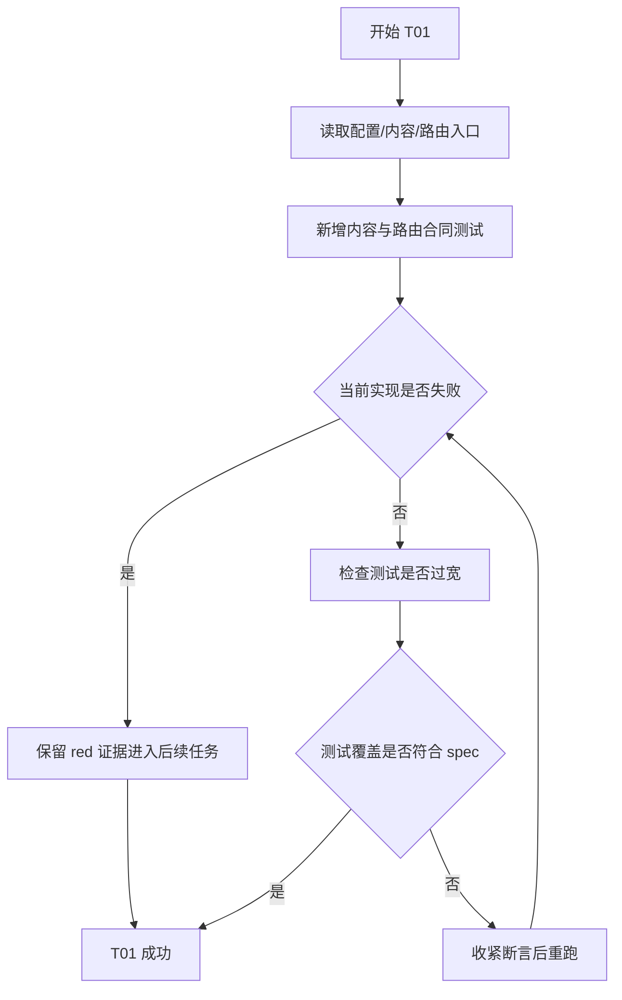
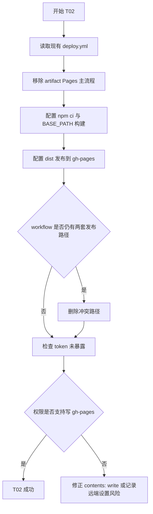
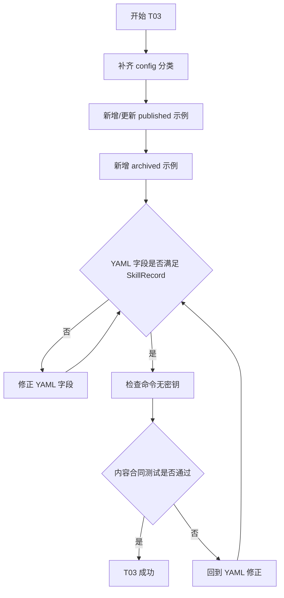
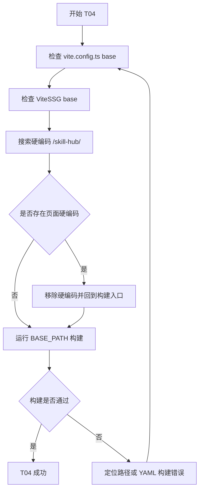
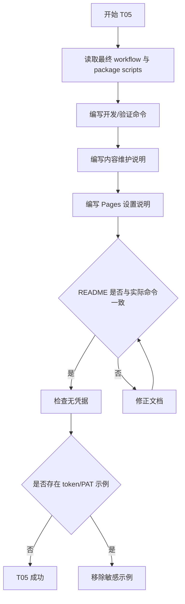
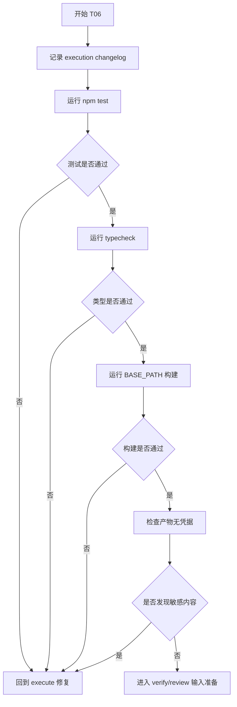

# Plan

## 交付单元标识

- Request: `prd-skillhub-personal-skill-distribution`
- Module: `module-04-static-delivery`
- 当前阶段：`plan`
- 上游批准：`module-04 spec` 已批准

## 阅读导航

- 请求目标：把 SkillHub 收束为由仓库 YAML 内容驱动、由 GitHub Actions 构建并发布到 `gh-pages` 分支的纯静态 GitHub Pages 站点。
- 任务总数：6
- 串行任务数：6
- 可并行任务数：0
- 高风险任务：`M04-T02` GitHub Actions 分支发布链路
- 关键依赖：`module-01` 的 Vite SSG / YAML 读取基础、`module-02` / `module-03` 的公开页面消费路径、已批准 module-04 spec

任务索引：

- `M04-T01`：测试先行锁定静态内容与部署合同
- `M04-T02`：收敛 GitHub Actions 到 `gh-pages` 分支发布
- `M04-T03`：补齐站点配置与示例技能内容
- `M04-T04`：确认 GitHub Pages base 与静态路由构建
- `M04-T05`：补齐 README 维护与部署说明
- `M04-T06`：执行验证并记录执行工件

## 全局摘要

本计划覆盖静态交付最后一段：部署 workflow、项目子路径构建、示例 YAML 内容和维护文档。执行主线采用串行方式：先写测试锁定合同，再改 workflow 与内容，随后验证 GitHub Pages base 构建，最后更新 README 和执行记录。

最大风险点是远端 GitHub Pages Settings 与 Actions token 写权限不能完全由代码控制；计划通过 README 和验证工件把人工配置点显式交接。当前模块不新增后台、不新增运行时 GitHub API、不新增部署状态页面。

实施前必须满足：

- `state.json` 当前模块为 `module-04-static-delivery`
- 当前模块 `spec_approved=true`
- 当前模块 `plan_approved=true` 后才允许进入 execute

## 任务拆解

### M04-T01 测试先行锁定静态内容与部署合同

**任务目标**

在改动实现前新增或调整测试，先让当前示例内容不足、归档技能缺失、路由过滤与部署合同差异暴露出来。

**规格映射**

- Acceptance Criteria 3、4、6、7
- Function-Complete Behavior Breakdown / 示例站点配置
- Function-Complete Behavior Breakdown / 示例技能内容

**范围与影响面**

- `src/content/config/site-config.ts`
- `src/content/skills/load-skill-records.ts`
- `src/router/index.ts`
- 新增或扩展相关测试文件

**前置条件**

- 已读取 `tsconfig.app.json -> tsconfig.json`
- 已读取 `src/env.d.ts` 中 `*.yaml?raw` 声明

**实现子项**

- 新增配置读取测试，断言 PRD 默认 6 个分类均存在。
- 新增内容读取或查询测试，断言至少存在多个 `published` 示例和至少一个 `archived` 示例。
- 新增路由测试，断言 published 技能生成详情静态路由，archived 技能不生成静态详情路由。
- 如测试导入 `routes`，保持对现有路由结构的黑盒断言，不把组件实现细节写进测试。

**交互与状态约束**

- 无页面交互。
- archived 状态只能验证“不公开消费”，不新增页面提示。

**API 与数据约束**

- 无远程 API。
- 测试只消费 `_data/*` 经现有读取入口得到的结果。

**测试与验证要点**

- 先运行相关测试看到当前失败，再通过后续任务修复。
- 最终纳入 `npm test`。

**风险与回退**

- 若直接导入 `routes` 导致组件装载副作用过重，回退为测试 `loadSkillRecords` + `getSkillById` + 公开查询层。

### M04-T02 收敛 GitHub Actions 到 `gh-pages` 分支发布

**任务目标**

把现有 official Pages artifact workflow 收敛为 spec 批准的 `main -> build -> gh-pages branch` 主路径。

**规格映射**

- Acceptance Criteria 1、7
- Function-Complete Behavior Breakdown / GitHub Actions 静态部署
- Design Constraints / 部署链路只保留一条主路径

**范围与影响面**

- `.github/workflows/deploy.yml`

**前置条件**

- `M04-T01` 已建立部署合同检查或人工检查点。
- 确认仓库使用 `package-lock.json`，CI 安装命令应为 `npm ci`。

**实现子项**

- 保留触发条件：`main` push 与 `workflow_dispatch`。
- 将权限调整为 `contents: write`，移除 artifact Pages 所需但分支发布不再需要的 `pages: write` / `id-token: write`。
- 使用 Node 24 与 npm cache。
- 将安装步骤改为 `npm ci`。
- 构建步骤设置 `BASE_PATH=/${{ github.event.repository.name }}/` 并执行 `npm run build`。
- 使用单一 `gh-pages` 分支发布 action 或等价分支发布步骤，把 `dist` 发布到 `gh-pages`。
- 不在 workflow 中写入明文 PAT；只使用 GitHub Actions 提供的 token。

**交互与状态约束**

- 构建成功才发布。
- 任一步失败则 job 失败，不更新 `gh-pages`。

**API 与数据约束**

- 无前端 API。
- workflow token 不进入前端代码和静态资源。

**测试与验证要点**

- 静态检查 workflow 中存在 `npm ci`、`BASE_PATH`、`publish_dir: ./dist` 或等价配置、`publish_branch: gh-pages` 或等价配置。
- 后续 `BASE_PATH=/skill-hub/ npm run build` 证明本地构建入口可用。

**风险与回退**

- 若远端仓库禁用 GitHub Actions 写权限，workflow 会失败；README 需提示开启 workflow write permission。
- 若所选分支发布 action 不可用，回退为等价 Git 命令发布步骤，但不得把自定义脚本散落到仓库源码。

### M04-T03 补齐站点配置与示例技能内容

**任务目标**

让 `_data/*` 成为足够覆盖公开页面的最小示例内容源，并包含 PRD 默认分类和归档过滤样例。

**规格映射**

- Acceptance Criteria 3、4、7
- Function-Complete Behavior Breakdown / 示例站点配置
- Function-Complete Behavior Breakdown / 示例技能内容
- API and Data Contracts / YAML 合同源

**范围与影响面**

- `_data/config.yaml`
- `_data/skills/*.yaml`

**前置条件**

- `M04-T01` 内容合同测试已存在。

**实现子项**

- 补齐分类：
  - `devtools` / 开发工具
  - `data` / 数据处理
  - `devops` / DevOps
  - `security` / 安全
  - `automation` / 办公自动化
  - `other` / 其他
- 保留 `site.title`、`site.description`、`site.baseUrl`。
- 至少保留 3 个 published 技能，覆盖不同分类与详情页字段。
- 新增至少 1 个 archived 技能，用于验证下架内容不进入公开列表和静态详情路由。
- 示例技能覆盖：
  - `id`
  - `name`
  - `category`
  - `version`
  - `shortDesc`
  - `fullDesc`
  - `installCommand`
  - `usageExamples`
  - `tags`
  - `changelog`
  - `status`
  - `installCount`
  - `createdAt`
  - `updatedAt`
- 示例命令使用公开占位域名或安全命令，不包含 token、PAT、私有密钥。

**交互与状态约束**

- published 内容可出现在首页、列表页、详情页和相关推荐。
- archived 内容只作为仓库内容存在，不公开展示。

**API 与数据约束**

- 不新增字段语义。
- 可选字段继续由 adapter 归一，不在页面模板补救。

**测试与验证要点**

- `npm test` 中内容合同测试通过。
- `npm run build` 能消费所有 YAML。

**风险与回退**

- 示例分类 key 必须与现有筛选逻辑一致；若新增分类导致页面显示异常，优先修正 YAML 与配置，不改页面行为。

### M04-T04 确认 GitHub Pages base 与静态路由构建

**任务目标**

确认 Vite / Vite SSG 在 GitHub Pages 项目子路径下构建可用，并且不把 `/skill-hub/` 硬编码到页面组件。

**规格映射**

- Acceptance Criteria 2、6
- Function-Complete Behavior Breakdown / GitHub Pages Base 和静态路径
- Edge Cases / `BASE_PATH=/skill-hub/`

**范围与影响面**

- `vite.config.ts`
- `src/app/main.ts`
- `src/router/index.ts`
- 构建验证命令

**前置条件**

- `M04-T02` 已确定 workflow 使用 `BASE_PATH=/${{ github.event.repository.name }}/`。
- `M04-T03` 示例内容已补齐。

**实现子项**

- 检查 `vite.config.ts` 是否继续使用 `process.env.BASE_PATH || '/'`。
- 检查 `ViteSSG` 入口是否继续使用 `base: import.meta.env.BASE_URL`。
- 使用 `rg` 确认页面组件没有硬编码 `/skill-hub/`。
- 本地执行 `BASE_PATH=/skill-hub/ npm run build`。

**交互与状态约束**

- 无新页面交互。
- 构建输出必须能覆盖 SSG 静态详情路由。

**API 与数据约束**

- 无远程 API。
- base 不进入技能数据模型。

**测试与验证要点**

- `BASE_PATH=/skill-hub/ npm run build` 通过。
- 如果构建警告仅为 chunk size 且与前序一致，记录为非阻塞。

**风险与回退**

- 如果发现路由或资源路径依赖根路径，先修构建入口，不把路径补丁写入页面组件。

### M04-T05 补齐 README 维护与部署说明

**任务目标**

把维护者需要知道的本地开发、验证、内容维护和 GitHub Pages 设置写入 README，保证交付链路不藏在聊天里。

**规格映射**

- Acceptance Criteria 5
- Function-Complete Behavior Breakdown / README 维护说明
- Human Review and Handoff

**范围与影响面**

- `README.md`

**前置条件**

- `M04-T02` 已确定最终 workflow 形态。
- `M04-T03` 已确定 YAML 示例字段口径。
- `M04-T04` 已确定构建命令。

**实现子项**

- 说明项目定位：纯静态 GitHub Pages，无后台、无登录、无运行时写仓库。
- 说明本地开发：
  - `npm install`
  - `npm run dev`
- 说明本地验证：
  - `npm test`
  - `npm run typecheck`
  - `npm run build`
  - `BASE_PATH=/skill-hub/ npm run build`
- 说明内容维护：
  - `_data/config.yaml`
  - `_data/skills/*.yaml`
  - `status: published | archived`
- 说明 GitHub Pages 设置：
  - source 选择 `gh-pages` branch
  - Actions 需要 workflow 写入权限
- 说明不应提交 GitHub Token、PAT 或私有密钥到 YAML / README 示例。

**交互与状态约束**

- README 只作维护说明，不新增前端运行时行为。

**API 与数据约束**

- 无远程 API。
- README 中示例字段必须与 `SkillRecord` 合同一致。

**测试与验证要点**

- 人工检查 README 命令与 `package.json` / workflow 一致。
- 验证 README 没有明文凭据。

**风险与回退**

- 如果 README 说明与实际 workflow 冲突，以 workflow 和 `package.json` 为准并修正文档。

### M04-T06 执行验证并记录执行工件

**任务目标**

在实现完成后执行验证命令，并把执行变更、验证证据和后续 review 输入记录到 module-04 工件。

**规格映射**

- Acceptance Criteria 1-7
- Human Review and Handoff
- Testing Policy

**范围与影响面**

- `docs/requests/prd-skillhub-personal-skill-distribution/module-runs/module-04-static-delivery/execution/changelog.md`
- 后续 `verification/verification.md`
- 后续 `review/review.md`

**前置条件**

- `M04-T01` 到 `M04-T05` 已完成。

**实现子项**

- 记录本模块执行变更：
  - workflow 发布方式
  - YAML 示例内容
  - README
  - 测试补强
- 执行：
  - `npm test`
  - `npm run typecheck`
  - `BASE_PATH=/skill-hub/ npm run build`
- 检查构建产物不包含明显 token / PAT 字符串。
- 若出现已有 chunk size 警告，记录为非阻塞风险。

**交互与状态约束**

- 验证失败时不能进入 review；按 workflow 回到 execute 修复。

**API 与数据约束**

- 无远程 API。
- 不进行真实远端 Pages 发布验证，远端设置作为人工交接点记录。

**测试与验证要点**

- 所有命令输出进入 verification 工件。
- review 需检查 `spec constraint compliance: pass`、`clean-code assessment: pass`、`design-pattern assessment: pass`。

**风险与回退**

- 如果网络或权限导致无法验证远端 Actions，记录本地可验证部分和远端人工检查点，不伪造成功发布结论。

## 功能拆解明细

### GitHub Actions 静态部署流程

- 起点：`main` push 或手动触发。
- 步骤：
  1. Checkout 仓库。
  2. Setup Node 24。
  3. 使用 `npm ci` 安装依赖。
  4. 使用 `BASE_PATH=/${{ github.event.repository.name }}/ npm run build` 生成 `dist`。
  5. 构建成功后发布 `dist` 到 `gh-pages` 分支。
- 分支条件：
  - 安装失败：job 失败，不发布。
  - 构建失败：job 失败，不发布。
  - 发布失败：job 失败，README 记录远端权限检查点。
- 终点：
  - 成功：`gh-pages` 分支更新。
  - 失败：线上保留上一版成功站点。

### 示例站点配置

- 展示所在容器：全站导航、分类筛选、页面 title / description。
- 字段清单：
  - `site.title`：站点名，必填，字符串。
  - `site.description`：站点描述，必填，字符串。
  - `site.baseUrl`：线上基础 URL，必填但允许空字符串。
  - `categories[].key`：分类稳定 key，必填。
  - `categories[].label`：分类中文文案，必填。
- 空值规则：
  - `site.baseUrl` 可为空字符串。
  - 分类 key / label 不允许空。
- 显隐条件：
  - 分类出现在公开筛选入口。

### 示例技能内容

- 展示所在容器：首页卡片、列表卡片、详情页、相关推荐、版本历史。
- 字段清单：
  - `id`：技能路由与唯一标识，必填。
  - `name`：展示名称，必填。
  - `category`：分类 key，必填，需匹配配置分类。
  - `version`：当前版本，必填。
  - `shortDesc`：卡片描述，必填。
  - `fullDesc`：详情 Markdown，必填。
  - `installCommand`：安装命令，必填。
  - `usageExamples`：使用示例，选填数组。
  - `tags`：标签，选填数组。
  - `changelog`：版本历史 Markdown，选填。
  - `status`：`published` 或 `archived`，必填。
  - `installCount`：展示用只读计数，选填 number。
  - `createdAt` / `updatedAt`：排序与展示时间，必填 ISO 字符串。
- 状态规则：
  - `published`：可公开展示并生成静态详情路由。
  - `archived`：不进入公开列表，不生成静态详情路由。
- 输入归一策略：
  - YAML 原始空值和可选数组由 adapter 归一。
  - 页面层不得补数据语义。

### README 维护说明

- 展示所在容器：仓库根 README。
- 内容分组：
  - 项目定位
  - 本地开发
  - 验证命令
  - 内容维护
  - GitHub Pages 部署设置
  - 安全注意事项
- 空值规则：
  - 不记录未确认的自定义域名。
- 跳转或复制：
  - 命令以代码块展示，便于维护者复制。

## 项目脚手架与初始化策略

- 当前模块不是新建项目，不重新选择脚手架。
- 继续复用 Vue 3 + Vite + TypeScript + Vite SSG。
- 执行阶段不得引入后台服务、SSR 服务或运行时部署代理。
- 允许调整：
  - `.github/workflows/deploy.yml`
  - `_data/*`
  - README
  - 聚焦测试文件

## API 对接与类型策略

- 无远程 API、无 protobuf、无 OpenAPI。
- 权威合同源：
  - `_data/config.yaml`
  - `_data/skills/*.yaml`
  - `src/types/content.ts`
  - `.github/workflows/deploy.yml`
- 类型策略：
  - 继续复用 `SiteConfigRecord`、`SkillRecord`、`SkillStatus`。
  - 不新增平行类型来复制 YAML 合同。
- adapter 边界：
  - 技能数据语义归一继续由 `src/content/adapters/skill-adapter.ts` 负责。
  - config 读取继续由 `src/content/config/site-config.ts` 负责。

## 依赖关系

| 任务 | 依赖 | 说明 |
| --- | --- | --- |
| `M04-T01` | 已批准 spec | 测试先行 |
| `M04-T02` | `M04-T01` | workflow 合同由测试 / 检查点锁定 |
| `M04-T03` | `M04-T01` | 内容测试先 red 后 green |
| `M04-T04` | `M04-T02`, `M04-T03` | 路径构建依赖 workflow 决策与内容完整 |
| `M04-T05` | `M04-T02`, `M04-T03`, `M04-T04` | README 必须写真实命令 |
| `M04-T06` | `M04-T01`-`M04-T05` | 完整验证 |

## 整洁性与复杂度控制

- workflow 只保留一条主部署链路，避免双路径配置漂移。
- YAML 示例只补最小充足集，不扩展成大型 mock 数据仓库。
- 不为部署引入 service / manager / runtime status store。
- 测试命名必须表达业务合同，例如“archived skills are not emitted as public routes”。
- 不在页面组件中写 base 路径或内容字段兜底。

## 模式决策与替代方案

- 采用：
  - 直接配置式部署：GitHub Actions workflow + Vite base + npm scripts。
  - 既有轻量 Adapter：YAML 到领域模型的语义归一。
- 拒绝：
  - 自定义部署管理器：当前变化轴不足以引入额外抽象。
  - 前端轮询 GitHub Actions 状态：超出纯静态范围。
  - 同时保留 official Pages artifact 和 `gh-pages` 分支发布：会产生维护歧义。

## 代码上下文与影响范围

- 已更新 `artifacts/code-context.md` 的 `module-04` addendum。
- 主要文件：
  - `.github/workflows/deploy.yml`
  - `_data/config.yaml`
  - `_data/skills/*.yaml`
  - `README.md`
  - 相关测试文件
- TypeScript 影响：
  - 可能新增测试导入 `routes`、`loadSiteConfig`、`loadSkillRecords`。
  - 遵守 `tsconfig.app.json -> tsconfig.json` 的 `strict`、`@/*` alias、`vite/client`、`node` 类型环境。

## 并行执行建议

- 不启用 workflow-style parallel execution。
- 原因：
  - workflow、内容、base 验证、README 强依赖同一套最终决策。
  - 当前模块规模小，串行执行更能避免文档与实际配置漂移。

## 触发与上下文准备

- 触发条件：用户批准 module-04 plan 后进入 execute。
- 上下文来源：
  - module-04 spec / clarifications
  - module-04 architecture design
  - 现有 workflow、Vite config、YAML、README、测试
- 人工观察点：
  - 执行完成后查看 changelog、verification、review 工件。
  - 远端 GitHub Pages Settings 由用户在仓库设置中确认。

## 受影响文件或模块

- `.github/workflows/deploy.yml`
- `_data/config.yaml`
- `_data/skills/*.yaml`
- `README.md`
- `src/content/config/site-config.test.ts` 或同等测试文件
- `src/router/router.test.ts` 或同等测试文件
- `docs/requests/prd-skillhub-personal-skill-distribution/artifacts/code-context.md`
- `docs/requests/prd-skillhub-personal-skill-distribution/module-runs/module-04-static-delivery/execution/changelog.md`

## 测试策略

- TDD 适用：
  - 内容配置分类。
  - published / archived 技能公开消费规则。
  - 静态详情路由过滤。
- 命令验证：
  - `npm test`
  - `npm run typecheck`
  - `BASE_PATH=/skill-hub/ npm run build`
- 人工 / 静态检查：
  - workflow 发布到 `gh-pages`。
  - README 命令与实际脚本一致。
  - 构建产物无 token / PAT。

## 观察与人工介入点

- 如果 GitHub Actions 远端发布失败，需要用户检查：
  - repository Actions workflow permissions 是否允许写入。
  - GitHub Pages source 是否选择 `gh-pages` branch。
- 如果用户要求改回 official Pages artifact deployment，必须回到 spec 修订部署决策。

## 回滚说明

- workflow 回滚：
  - 可恢复上一版 `.github/workflows/deploy.yml`，但必须同步修订 spec / plan，因为部署合同会改变。
- YAML 回滚：
  - 可单独回滚 `_data/skills/*.yaml` 示例内容；测试会提示公开内容覆盖是否不足。
- README 回滚：
  - 可回滚文档，但不得留下与实际 workflow 冲突的命令。
- 构建失败：
  - 不推进 verify / review，回到 execute 修复。
