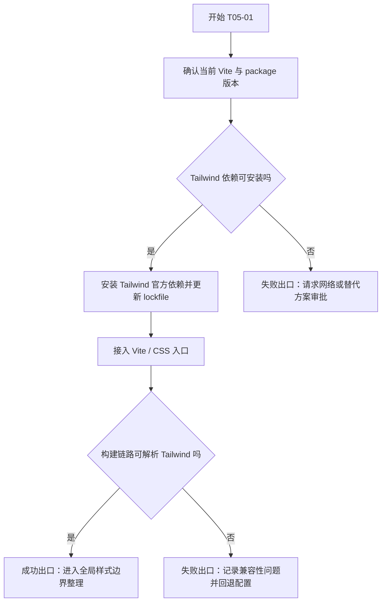
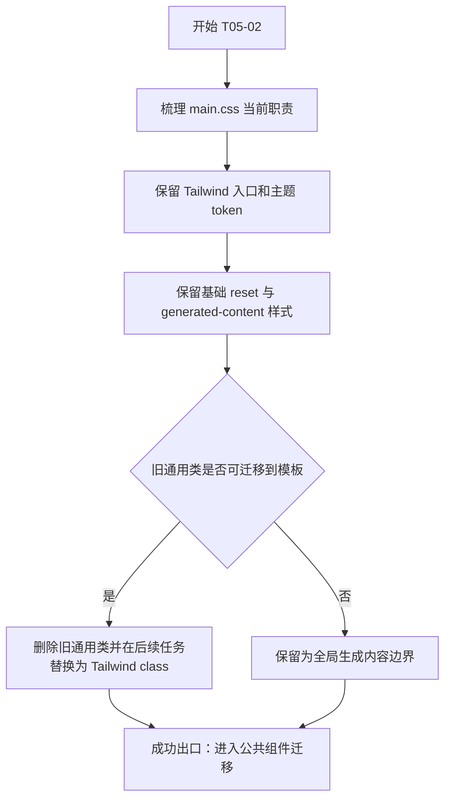
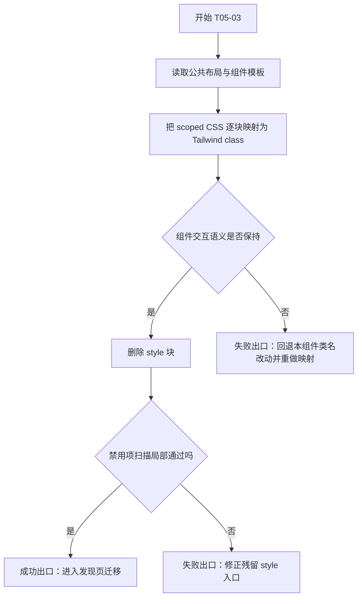
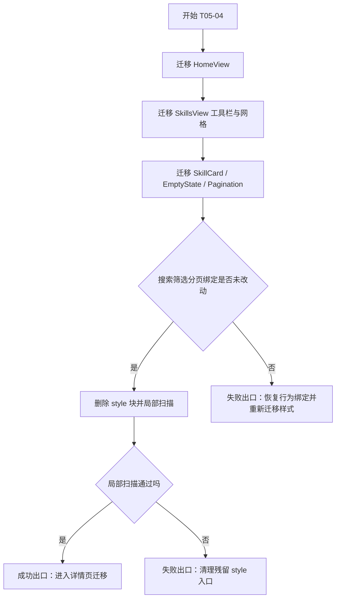
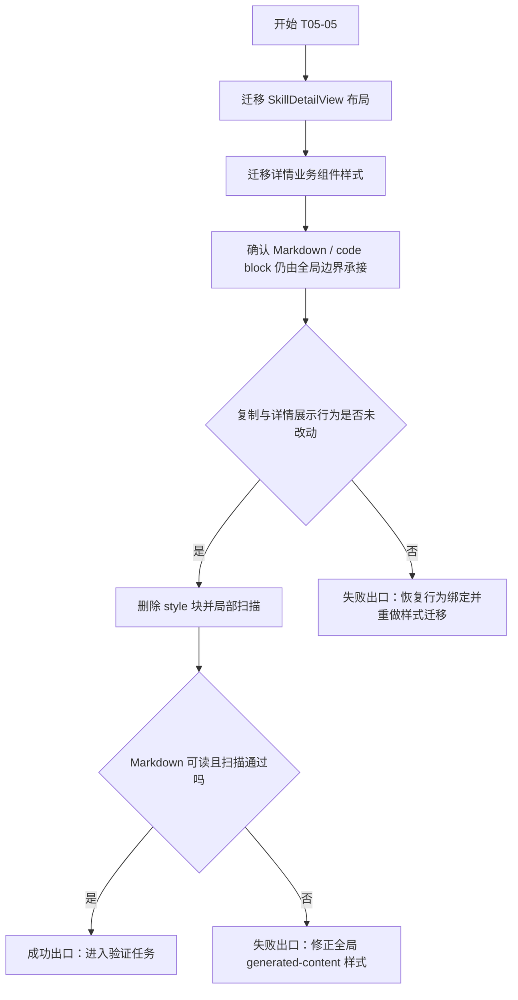
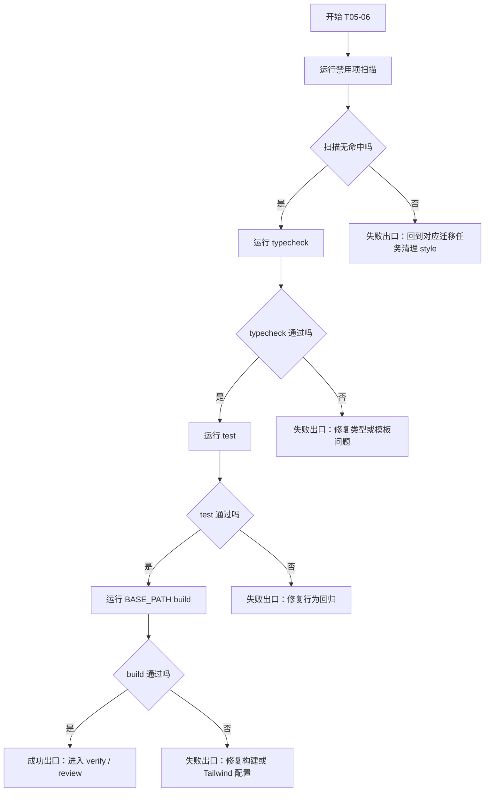

# Plan - module-05-tailwind-style-refactor

## 交付单元标识

- Request: `prd-skillhub-personal-skill-distribution`
- Module: `module-05-tailwind-style-refactor`
- Stage: `plan`
- Spec: `module-runs/module-05-tailwind-style-refactor/spec/spec.md`

## 阅读导航

- 目标摘要：把全站页面和组件迁移到真实 Tailwind CSS utility-first 样式体系，移除 Vue SFC style 标签和模板行内 style。
- 任务总数：6
- 串行任务数：6
- 可并行任务数：0
- 高风险任务：T05-01 Tailwind 依赖安装与 Vite 集成；T05-05 详情页 Markdown / 代码块样式边界。
- 关键依赖：`package.json`、`vite.config.ts`、`src/assets/styles/main.css`、所有现存 `<style scoped>` 的 Vue SFC。
- 快速定位：T05-01 构建接入；T05-02 全局样式边界；T05-03 公共布局；T05-04 首页 / 列表；T05-05 详情页；T05-06 验证与证据。

## 全局摘要

本计划覆盖 `module-05` 的样式架构变更：接入 Tailwind CSS，迁移当前公开站点页面和组件的 scoped CSS 到模板 utility class，保留全局 CSS 作为 Tailwind 入口、主题变量和 Markdown 生成内容边界。实施主线是先固定构建与全局边界，再迁移共享布局组件，随后迁移页面与业务组件，最后执行禁用项扫描、测试、类型检查和 GitHub Pages base path 构建。

最大风险是 Tailwind 依赖安装需要网络授权，以及 Markdown 运行时 HTML 无法直接在 Vue 模板中加类。计划中明确：依赖安装失败不得退回 scoped CSS；Markdown 样式允许保留在全局 CSS 文件，但不得使用组件 `<style>` 或行内 `style`。

## 任务拆解

### T05-01 - Tailwind 依赖与 Vite 样式链路接入

#### 任务目标

安装并配置真实 Tailwind CSS，使项目构建链路能处理 Tailwind utility class。

#### 规格映射

- In Scope：接入真实 Tailwind CSS 到 Vite 构建链路。
- Acceptance Criteria：`package.json` 与构建配置体现 Tailwind CSS 接入。

#### 范围与影响面

- `package.json`
- `package-lock.json`
- `vite.config.ts`
- `src/assets/styles/main.css`

#### 前置条件

- `module-05 spec` 已审批。
- `module-05 plan` 已审批。
- 如本地缺少 Tailwind 依赖，需要在执行阶段通过允许的网络命令安装。

#### 实现子项

- 使用与当前 Vite 版本兼容的 Tailwind 官方集成方式。
- 更新 `package.json` 和 lockfile。
- 更新 `vite.config.ts` 插件链路或等价配置。
- 确认 `src/assets/styles/main.css` 是唯一 Tailwind 入口。

#### 交互与状态约束

- 不改变任何页面交互。
- 不引入运行时状态。

#### API 与数据约束

- 无 API。
- 无数据 adapter 变更。

#### 测试与验证要点

- 安装后运行构建验证。
- 如果安装失败，记录失败并阻塞，不使用伪 Tailwind 或 scoped CSS 回退。

#### 风险与回退

- 风险：网络受限或 Tailwind / Vite 插件版本不兼容。
- 回退：撤回依赖与配置改动，保留 plan，等待用户确认替代方案。

#### Mermaid 流程图

### T05-02 - 全局样式边界与主题 token 收敛

#### 任务目标

整理 `main.css`，保留 Tailwind import、主题变量、基础 reset、body 背景、Markdown / code block 生成内容样式，移除可迁移到组件模板的旧通用类。

#### 规格映射

- Function-Complete Behavior Breakdown：全局样式链路。
- Design Constraints：全局 CSS 文件允许存在，但职责收敛。

#### 范围与影响面

- `src/assets/styles/main.css`
- 依赖 `.markdown-body` 的详情页内容。

#### 前置条件

- T05-01 完成。

#### 实现子项

- 引入 Tailwind CSS。
- 保留 `:root` 和 `:root[data-theme='light']` 主题变量。
- 保留 `html`、`body`、`#app` 基础规则。
- 保留 `.markdown-body` 与代码块必要样式。
- 删除或迁移 `.app-container`、`.surface-card`、`.eyebrow`、`.ghost-input` 等组件可表达类。

#### 交互与状态约束

- 主题切换仍只通过 root `data-theme` 控制。
- 不使用行内 CSS variable 写入。

#### API 与数据约束

- 无 API。
- 无数据 adapter 变更。

#### 测试与验证要点

- 暗色 / 亮色主题 token 均仍可被页面类名或全局生成内容样式消费。
- Markdown 正文和代码块仍可读。

#### 风险与回退

- 风险：误删 Markdown / body 基础样式造成详情页正文退化。
- 回退：仅恢复全局生成内容样式，不恢复 Vue SFC style。

#### Mermaid 流程图

### T05-03 - 公共布局与通用组件迁移

#### 任务目标

迁移全局布局、Header、Footer 和主题切换组件的 scoped CSS 到 Tailwind utility class。

#### 规格映射

- Function-Complete Behavior Breakdown：页面与布局组件。
- 样式禁用项：不得保留 `<style>` / `style=`。

#### 范围与影响面

- `src/layouts/PublicLayout.vue`
- `src/components/common/AppHeader.vue`
- `src/components/common/AppFooter.vue`
- `src/components/common/ThemeToggle.vue`

#### 前置条件

- T05-02 完成。

#### 实现子项

- 用 Tailwind 表达 app shell、container、sticky header、blur 背景、导航、footer。
- 用 Tailwind 表达主题切换按钮尺寸、边框、hover、focus-visible。
- 删除公共组件中的 `<style scoped>`。
- 不新增 style helper 或样式 manager。

#### 交互与状态约束

- 主题切换按钮语义、aria label 和点击行为不变。
- Header 路由导航行为不变。

#### API 与数据约束

- 无 API。
- 无数据 adapter 变更。

#### 测试与验证要点

- typecheck 捕获模板和组件引用错误。
- 视觉回归重点检查 Header sticky / blur 和移动端间距。

#### 风险与回退

- 风险：Header 层级或 backdrop blur 表达不一致。
- 回退：在 Tailwind class 内调整 z-index / background / border，不恢复 scoped CSS。

#### Mermaid 流程图

### T05-04 - 首页、列表页与发现组件迁移

#### 任务目标

迁移首页、技能列表页、技能卡片、空状态和分页组件样式，保持搜索、筛选、排序、分页与结果统计行为不变。

#### 规格映射

- Function-Complete Behavior Breakdown：首页与技能列表。
- Acceptance Criteria：首页、技能列表行为不因样式迁移改变。

#### 范围与影响面

- `src/views/HomeView.vue`
- `src/views/SkillsView.vue`
- `src/features/skills/components/SkillCard.vue`
- `src/features/skills/components/SkillGridEmptyState.vue`
- `src/features/skills/components/SkillPagination.vue`

#### 前置条件

- T05-03 完成。

#### 实现子项

- 迁移 hero、统计卡片、分类入口、搜索工具栏、筛选按钮、排序控件、结果统计。
- 迁移技能卡片 hover、边框、标签、版本、描述和移动端间距。
- 迁移空状态与分页按钮 active / disabled 状态。
- 删除所有相关 `<style scoped>`。

#### 交互与状态约束

- 搜索输入归一、筛选叠加、排序、分页逻辑不变。
- 分页 disabled 状态不变。
- 卡片路由跳转不变。

#### API 与数据约束

- 无 API。
- 不修改 skill query、adapter 或 YAML 数据模型。

#### 测试与验证要点

- 现有搜索 / 查询相关测试继续通过。
- 手动或构建后检查首页、列表页在移动端和桌面端布局未断裂。

#### 风险与回退

- 风险：类名迁移时误改模板条件或事件绑定。
- 回退：只回退该组件模板结构改动，保留已完成的 Tailwind 接入和无 style 原则。

#### Mermaid 流程图

### T05-05 - 技能详情页与转化组件迁移

#### 任务目标

迁移详情页、安装命令卡片、元信息、版本历史和相关推荐组件样式，保持 Markdown 渲染和复制安装命令行为不变。

#### 规格映射

- Function-Complete Behavior Breakdown：技能详情与转化组件。
- Edge Cases：Markdown 生成 HTML 由全局 `.markdown-body` 样式承接。

#### 范围与影响面

- `src/views/SkillDetailView.vue`
- `src/features/skills/components/InstallCommandCard.vue`
- `src/features/skills/components/SkillDetailMeta.vue`
- `src/features/skills/components/SkillVersionHistory.vue`
- `src/features/skills/components/SkillRelatedList.vue`
- `src/assets/styles/main.css` 的 `.markdown-body` 生成内容样式。

#### 前置条件

- T05-04 完成。

#### 实现子项

- 迁移详情页头部、元信息、内容区、侧栏或分区布局。
- 迁移安装命令卡片、复制按钮、成功 / 失败提示视觉状态。
- 迁移版本历史和相关技能列表。
- 保留 `.markdown-body` 全局样式，避免在 renderer 中引入复杂 AST class 注入。
- 删除所有相关 `<style scoped>`。

#### 交互与状态约束

- 复制按钮触发、成功反馈、失败反馈不变。
- Markdown `v-html` 安全渲染边界不变。
- 相关推荐数量和过滤规则不变。

#### API 与数据约束

- 无 API。
- 不修改 `render-markdown.ts` 的安全策略，除非执行阶段发现样式 class 需要非行为性 wrapper 调整；任何安全策略变化都需回退到 spec。

#### 测试与验证要点

- 详情页相关现有测试继续通过。
- 构建后检查 Markdown 标题、段落、列表、pre/code 可读。

#### 风险与回退

- 风险：Markdown / highlight.js 生成内容样式边界收敛过度。
- 回退：恢复全局 `.markdown-body` 必要规则，不恢复组件 scoped CSS。

#### Mermaid 流程图

### T05-06 - 禁用项扫描与完整回归验证

#### 任务目标

证明 module-05 满足 spec acceptance criteria，并为 verify / review 提供证据。

#### 规格映射

- Acceptance Criteria 全部条目。
- Design Constraints：禁用项扫描是 hard acceptance criterion。

#### 范围与影响面

- 全部 `src/**/*.vue`
- `package.json`
- `vite.config.ts`
- `src/assets/styles/main.css`
- 测试与构建命令。

#### 前置条件

- T05-01 至 T05-05 完成。

#### 实现子项

- 运行 `rtk rg -n '<style|style=' src`，期望无命中。
- 运行 `rtk npm run typecheck`。
- 运行 `rtk npm test`。
- 运行 `rtk env BASE_PATH=/skill-hub/ npm run build`。
- 记录执行结果到 execution / verification 工件。

#### 交互与状态约束

- 若验证发现行为测试失败，回到对应迁移任务修复。
- 若只存在构建体积 warning，按既有 module-04 处理方式记录，不视为阻塞，除非新增错误。

#### API 与数据约束

- 无 API。
- 无数据 adapter 变更。

#### 测试与验证要点

- 禁用项扫描必须无命中。
- typecheck/test/build 必须通过。
- 失败时不得声称完成。

#### 风险与回退

- 风险：Tailwind 内容扫描漏掉动态类导致样式缺失。
- 回退：改成静态可扫描类名或在全局 CSS 中以 Tailwind layer 承接，不使用行内 style。

#### Mermaid 流程图

## 功能拆解明细

### 全局样式功能单元

| 功能单元 | 实现规则 | 空态 / 异常 | 验证 |
| --- | --- | --- | --- |
| Tailwind 入口 | `main.css` 是唯一 Tailwind CSS 入口 | 依赖安装失败时阻塞 | build 可解析 Tailwind |
| 主题 token | `:root` 与 `:root[data-theme='light']` 保留 | token 缺失时页面色彩不可读，必须修复 | 主题切换后页面可读 |
| 生成内容样式 | `.markdown-body` / code block 保留在全局 CSS | Markdown 不可读时修复全局边界 | 详情页 Markdown 可读 |
| 禁用项 | Vue SFC 无 `<style>` / `style=` | 任一命中均阻塞 | `rg` 无命中 |

### 公共布局功能单元

| 功能单元 | 实现规则 | 交互约束 | 验证 |
| --- | --- | --- | --- |
| Header | Tailwind 表达 sticky、blur、导航布局 | 路由导航不变 | typecheck / 预览 |
| ThemeToggle | Tailwind 表达按钮、状态、focus | 点击切换主题不变 | 现有主题测试 |
| Footer | Tailwind 表达间距和文字层级 | 无交互变更 | build |

### 首页与列表功能单元

| 功能单元 | 实现规则 | 交互约束 | 验证 |
| --- | --- | --- | --- |
| Hero / stats | Tailwind 表达层级、网格、响应式 | 首页入口不变 | build / 预览 |
| 搜索筛选工具栏 | Tailwind 表达输入、按钮、select | 搜索、筛选、排序不变 | 现有查询测试 |
| SkillCard | Tailwind 表达卡片、hover、标签、版本 | 跳转详情不变 | router / build |
| Pagination | Tailwind 表达 active / disabled | 翻页逻辑不变 | test / typecheck |

### 详情页功能单元

| 功能单元 | 实现规则 | 交互约束 | 验证 |
| --- | --- | --- | --- |
| Detail header | Tailwind 表达标题、标签、元信息布局 | 详情数据读取不变 | detail tests / build |
| InstallCommandCard | Tailwind 表达命令块、复制按钮、反馈 | 剪贴板副作用边界不变 | existing tests / manual check |
| Markdown body | 全局 `.markdown-body` 承接生成 HTML 样式 | sanitize / renderer 不变 | Markdown 可读 |
| Related / versions | Tailwind 表达列表和卡片 | 推荐规则、版本顺序不变 | query tests |

## 项目脚手架与初始化策略

- 本模块不是 greenfield 项目初始化。
- 沿用当前 Vue 3 + Vite + Vite SSG 工程。
- 不重新选择脚手架。
- 执行阶段不得把样式迁移扩大为项目重构。

## API 对接与类型策略

- 无后端 API。
- 无 request-layer 改动。
- 无 adapter / mapper 改动。
- TypeScript context：根 `tsconfig.json` governs 当前作用域，执行阶段需再次读取 `tsconfig.json`、`src/env.d.ts` 与 `src/types/vendor.d.ts`，确认 Vite / Vue / 第三方声明边界。

## 依赖关系

| 任务 | 依赖 | 说明 |
| --- | --- | --- |
| T05-01 | plan approval | 先接入 Tailwind 构建能力 |
| T05-02 | T05-01 | 全局样式依赖 Tailwind 入口 |
| T05-03 | T05-02 | 公共布局依赖全局 token |
| T05-04 | T05-03 | 页面组件依赖公共布局类名口径 |
| T05-05 | T05-04 | 详情页承接全局 Markdown 边界 |
| T05-06 | T05-01 至 T05-05 | 全量验证 |

## 整洁性与复杂度控制

- 保持页面容器、业务组件、公共组件职责不变。
- 不引入 CSS-in-JS、style manager、theme strategy object。
- 不用组件 `<style>` 或行内 `style` 临时兜底。
- 不把旧 scoped CSS 原封不动搬到全局类名。
- 动态样式优先表达为条件 class；若需要 token，使用已有 CSS variables 或 Tailwind arbitrary value class。

## 模式决策与替代方案

- 采用 Tailwind utility-first，不引入命名设计模式。
- 拒绝方案一：自定义 utility class 模拟 Tailwind。原因：不满足“真实 Tailwind CSS 构建接入”的 spec 决策。
- 拒绝方案二：CSS-in-JS。原因：会引入新运行时样式层，并违背用户禁止内联样式的方向。
- 拒绝方案三：renderer AST 注入所有 Markdown class。原因：为样式迁移引入过度复杂边界；全局 `.markdown-body` 更轻。

## 代码上下文与影响范围

- 当前已知 `<style scoped>` 命中文件：13 个 Vue SFC。
- 影响范围包括 `src/assets/styles/main.css`、`vite.config.ts`、package 文件和上述 Vue SFC。
- code graph 当前缺失；本模块为样式迁移，影响面可由 `rg` 和局部源码阅读覆盖。
- 执行阶段需读取目标文件、`tsconfig.json`、`src/env.d.ts`、`src/types/vendor.d.ts`，避免猜测 Vite / Vue 类型上下文。

## 并行执行建议（含是否值得启用 workflow）

- 不启用 workflow-style parallel execution。
- 理由：任务共享全局样式边界和 Tailwind class 口径，单线程迁移更利于保持视觉一致性和减少冲突。
- 如未来团队多人执行，可在 T05-02 完成后把 T05-04 和 T05-05 拆给不同人，但必须由同一人做最终禁用项扫描与视觉口径收敛。

## 触发与上下文准备

- 触发：用户批准 `module-05 plan`。
- 上下文准备：
  - 读取 `state.json`，确认 `current_module_id=module-05-tailwind-style-refactor`。
  - 读取 approved spec / clarifications。
  - 读取 `tsconfig.json`、`src/env.d.ts`、`src/types/vendor.d.ts`。
  - 扫描 `<style|style=` 当前命中。
  - 如需安装依赖，先执行安装命令；若网络受限，请求授权。

## 受影响文件或模块

- `package.json`
- `package-lock.json`
- `vite.config.ts`
- `src/assets/styles/main.css`
- `src/layouts/PublicLayout.vue`
- `src/components/common/AppHeader.vue`
- `src/components/common/AppFooter.vue`
- `src/components/common/ThemeToggle.vue`
- `src/views/HomeView.vue`
- `src/views/SkillsView.vue`
- `src/views/SkillDetailView.vue`
- `src/features/skills/components/SkillCard.vue`
- `src/features/skills/components/SkillGridEmptyState.vue`
- `src/features/skills/components/SkillPagination.vue`
- `src/features/skills/components/InstallCommandCard.vue`
- `src/features/skills/components/SkillDetailMeta.vue`
- `src/features/skills/components/SkillVersionHistory.vue`
- `src/features/skills/components/SkillRelatedList.vue`
- 请求工件：execution / verification / review。

## 测试策略

- TDD 说明：本模块主要是样式表达迁移，不改变业务行为；不新增行为测试。验证重点是禁止项扫描和现有行为测试回归。
- 必跑命令：
  - `rtk rg -n '<style|style=' src`
  - `rtk npm run typecheck`
  - `rtk npm test`
  - `rtk env BASE_PATH=/skill-hub/ npm run build`
- 若迁移中触及行为逻辑，必须补充或调整现有 Vitest 覆盖后再继续。

## 观察与人工介入点

- Tailwind 依赖安装失败：需要用户允许网络安装或审批替代方案。
- 构建插件版本不兼容：需要记录实际错误并确认是否改用 Tailwind 官方兼容接入方式。
- 禁用项扫描仍有命中：不得进入 verify，必须回到对应迁移任务。
- 视觉方向发生明显改变：优先调整 Tailwind class，避免把需求扩大为品牌重设计。

## 回滚说明

- 依赖安装失败前：不应产生代码变更，可直接停在 execute 前置阻塞。
- T05-01 失败：回退 Tailwind 依赖、lockfile 和 Vite 配置。
- T05-02 至 T05-05 失败：按文件回退对应模板类名迁移，但不恢复组件 style 标签作为最终方案。
- T05-06 失败：根据失败项回到对应任务修复，不能跳过验证。
