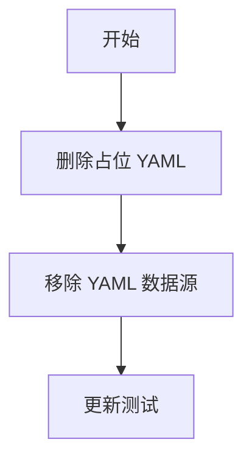
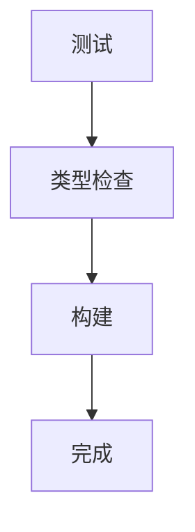

# 交付单元标识

- module_id: module-01-remove-placeholder-source

# 任务

## T1 - 删除占位数据

删除 `_data/skills/*.yaml`。

```mermaid
flowchart TD
  A["开始"] --> B["删除占位 YAML"]
  B --> C["移除 YAML 数据源"]
  C --> D["更新测试"]
```

## T2 - 验证

运行测试、类型检查和构建。

```mermaid
flowchart TD
  A["测试"] --> B["类型检查"]
  B --> C["构建"]
  C --> D["完成"]
```
