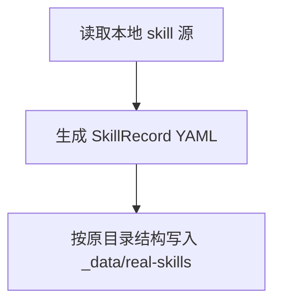
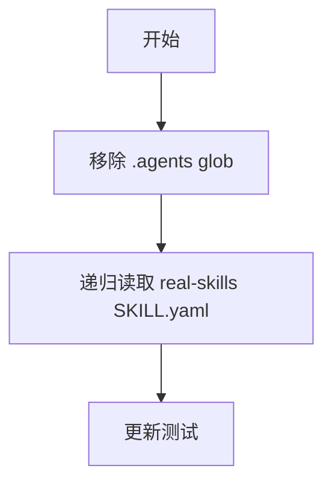
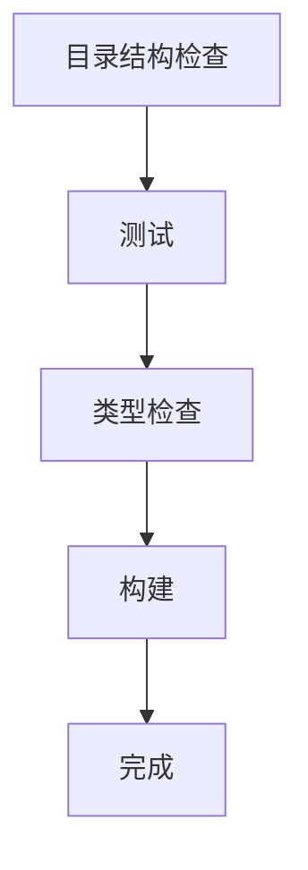

# 交付单元标识

- module_id: module-01-real-skill-data-directory

# 任务

## T1 - 创建真实 skill 数据目录

新增 `_data/real-skills/`，并通过脚本从 `.agents/skills` 同步生成 YAML。输出路径保留源 skill 的相对目录结构。

## T2 - 切换前端数据源

修改 `loadSkillRecords()`，只读取 `_data/real-skills/**/SKILL.yaml`。

## T3 - 验证

运行测试、类型检查和构建，并验证嵌套目录中存在代表性顶层 skill 与 subskill。

