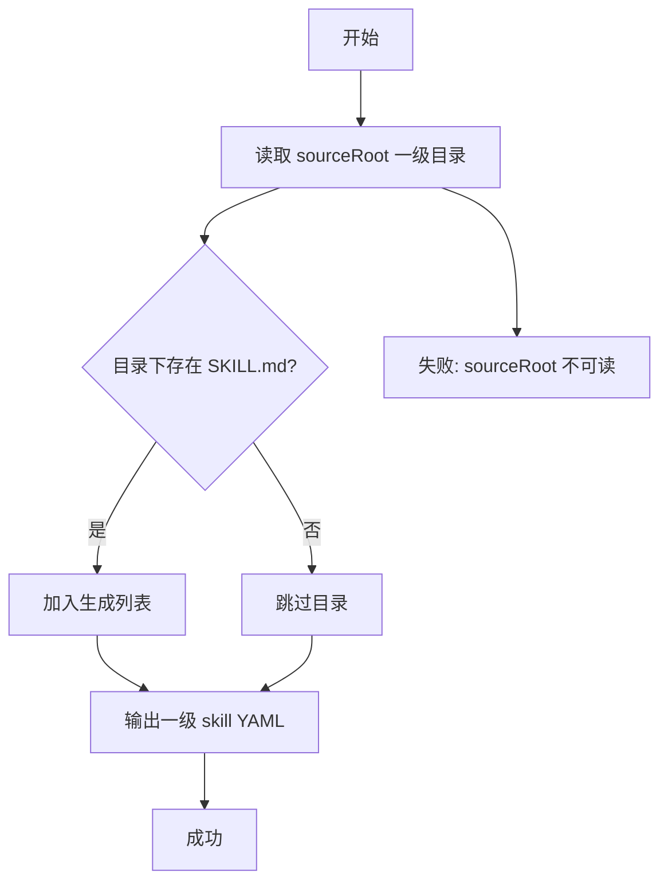
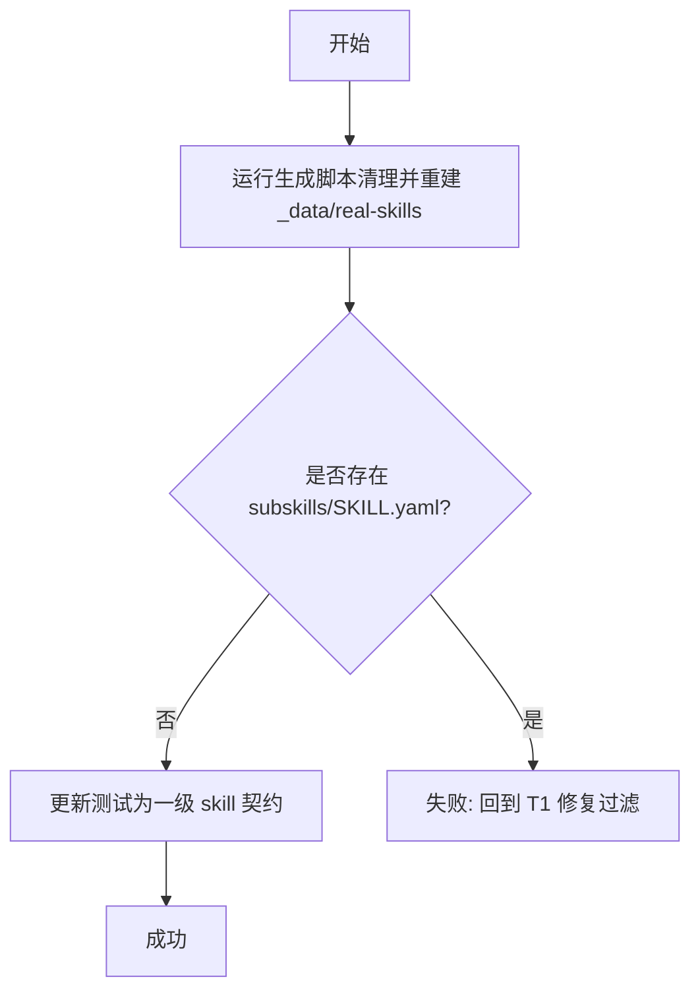
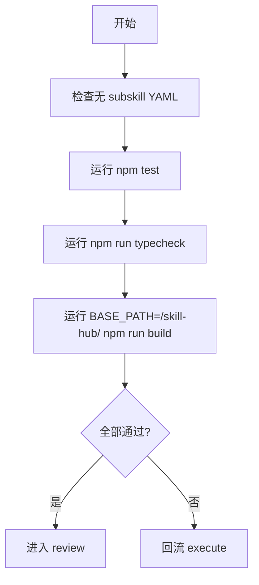

# 交付单元标识

- request_id: use-real-skill-data-directory
- module_id: module-02-top-level-skill-yaml-only

# 阅读导航

- 目标：只为 `.agents/skills` 一级 skill 生成 YAML，安装命令复制整个 skill 目录。
- 任务总数：3。
- 串行任务数：3。
- 可并行任务数：0。
- 高风险点：旧 subskill YAML 残留导致页面仍展示 subskill 条目。

# 全局摘要

本次计划调整真实 skill 数据生成契约。执行主线是先收紧生成脚本的源文件发现范围，再重新生成 `_data/real-skills`，最后更新测试和验证命令，确保数据目录只包含一级 skill YAML，且安装命令仍以完整 skill 目录为目标。

# 任务拆解

## T1 - 收紧生成脚本源文件发现规则

- 任务目标：只发现 `.agents/skills/<skill>/SKILL.md`。
- 规格映射：一级 skill YAML 生成。
- 范围与影响面：`scripts/generate-real-skill-data.mjs`。
- 前置条件：读取现有生成逻辑。
- 实现子项：把递归 `findSkillFiles` 改为只遍历 `sourceRoot` 一级目录并检查主 `SKILL.md`。
- 禁止猜测边界：不得在渲染阶段为 subskill 再生成记录。
- 测试与验证要点：生成日志数量应等于一级 skill 数量。
- 风险与回退：若一级目录不含 `SKILL.md`，应跳过而不是报错。

## T2 - 重新生成数据并更新测试契约

- 任务目标：删除旧 subskill YAML 输出，保留一级 skill YAML。
- 规格映射：安装命令语义、内容加载契约。
- 范围与影响面：`_data/real-skills/**/SKILL.yaml`、`src/content/skills/load-skill-records.test.ts`。
- 前置条件：T1 完成。
- 实现子项：运行生成脚本；测试断言数量为 5；断言 subskill YAML 不存在；断言 subskill ID 不出现在 records；断言主 skill installCommand 指向目录。
- 禁止猜测边界：不得保留 `agent-frontend-agent-framework-verify` 这类 subskill 记录。
- 测试与验证要点：`import.meta.glob` source 数量与加载结果数量一致。
- 风险与回退：如果新增一级 skill，需同步调整固定数量或改为动态期望。

## T3 - 验证与收口

- 任务目标：证明实现满足 spec 验收标准。
- 规格映射：全部验收标准。
- 范围与影响面：测试、类型检查、构建、工作流工件。
- 前置条件：T1、T2 完成。
- 实现子项：运行 `npm test`、`npm run typecheck`、`BASE_PATH=/skill-hub/ npm run build`；记录执行结果；完成 verify/review 工件。
- 禁止猜测边界：不能用未运行命令替代验证证据。
- 测试与验证要点：命令退出码为 0，且 `rg` 检查无 subskill YAML。
- 风险与回退：如验证失败，回流 execute 修复。

# 功能拆解明细

- 本模块不涉及表单、表格或页面交互。
- 数据生成功能单元：从 `.agents/skills` 一级目录读取主 `SKILL.md`，输出同名目录下的 `SKILL.yaml`。
- 数据加载功能单元：继续通过 `_data/real-skills/**/SKILL.yaml` 读取静态记录，但数据源中不再包含 subskill YAML。

# 项目脚手架与初始化策略

- 非 greenfield，无脚手架任务。

# API 对接与类型策略

- 不涉及后端 API。
- TypeScript 作用域由 `tsconfig.app.json` 继承 `tsconfig.json`；测试使用 Vite/Vitest 的 `import.meta.glob` 类型上下文。

# 依赖关系

- T1 必须先于 T2。
- T2 必须先于 T3。
- 不启用并行执行。

# 整洁性与复杂度控制

- 源过滤逻辑保持在单一函数内。
- 不新增模式层、配置层或运行时过滤层。
- 测试命名直接反映“一级 skill only”契约。

# Tailwind 样式约束

- 不涉及样式改动。

# 模式决策与替代方案

- 使用直接文件发现过滤。
- 拒绝运行时过滤模式，因为会让无效 YAML 留在数据目录。

# 代码上下文与影响范围

- `scripts/generate-real-skill-data.mjs`
- `_data/real-skills/**/SKILL.yaml`
- `src/content/skills/load-skill-records.test.ts`

# 并行执行建议

- 不建议并行。生成脚本、数据输出和测试契约高度耦合。

# 触发与上下文准备

- 触发：用户当前变更要求。
- 上下文：现有 request 工件、生成脚本、真实 `.agents/skills` 目录。

# 受影响文件或模块

- `scripts/generate-real-skill-data.mjs`
- `_data/real-skills/**/SKILL.yaml`
- `src/content/skills/load-skill-records.test.ts`
- `docs/requests/use-real-skill-data-directory/**`

# 测试策略

- 先更新测试期望为新契约。
- 运行生成脚本生成真实数据。
- 运行 `npm test` 覆盖内容加载契约。
- 运行 `npm run typecheck` 覆盖 TS 上下文。
- 运行 `BASE_PATH=/skill-hub/ npm run build` 覆盖 GitHub Pages 构建。

# 观察与人工介入点

- 若一级 skill 数量与预期 5 不一致，检查 `.agents/skills` 目录是否发生变化。
- 若 build 失败但与本模块无关，记录 residual risk 并隔离原因。

# 回滚说明

- 如需回滚，恢复生成脚本递归发现逻辑并重新生成 `_data/real-skills`。
- 但该回滚会违反用户当前明确要求，不能作为本模块交付方案。
